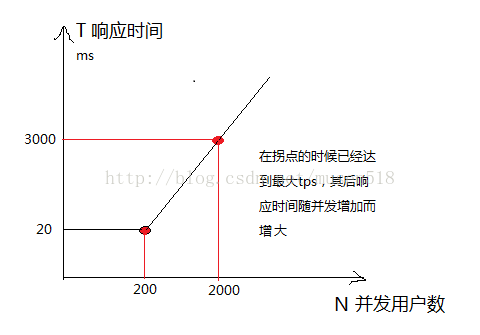
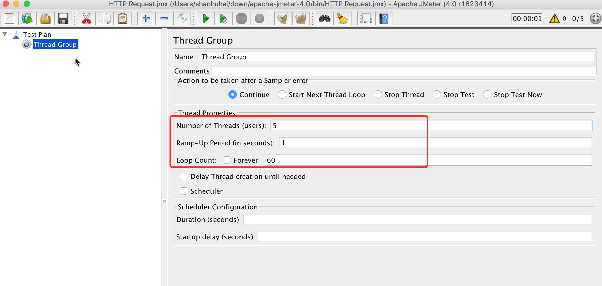
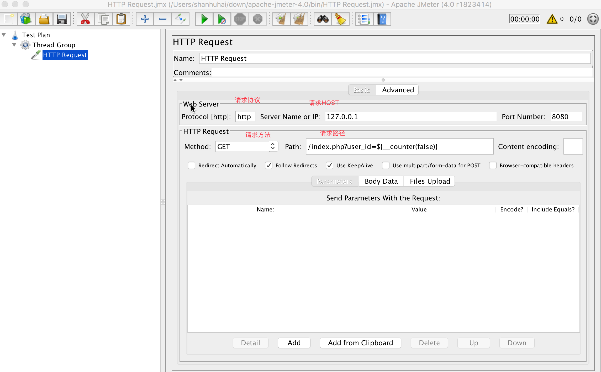
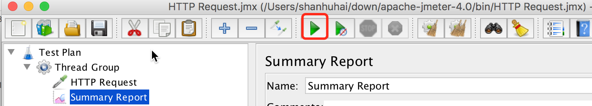
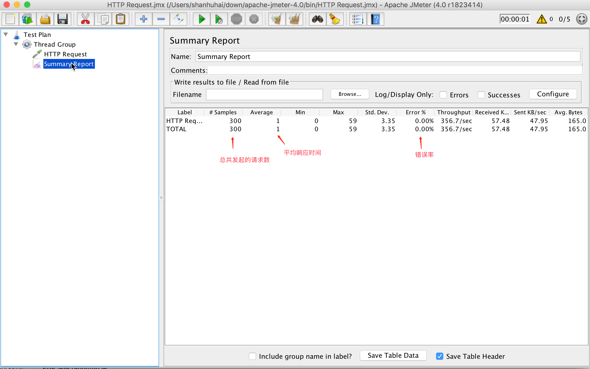
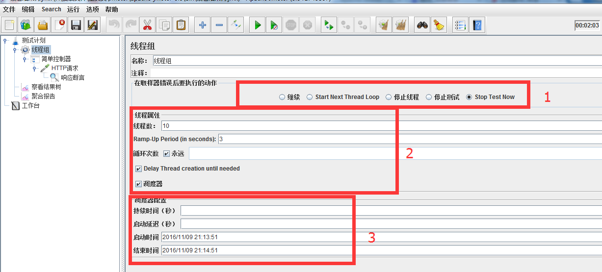
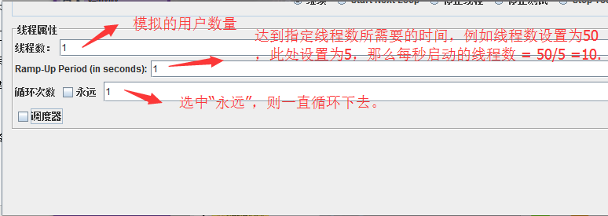
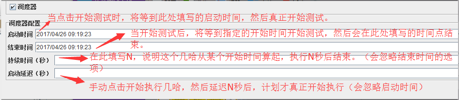
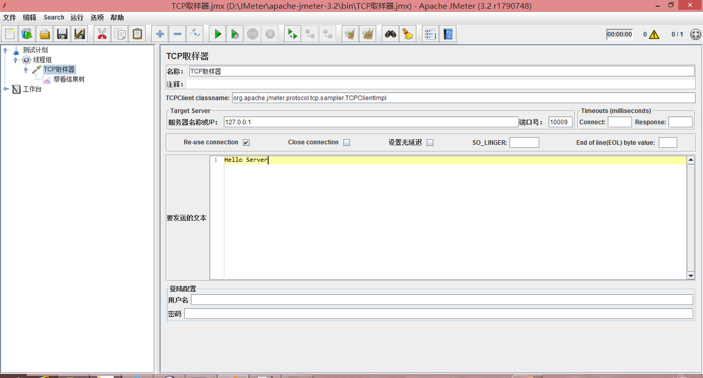

# JMeter与性能压测


 jmeter是一款纯java的性能测试工具，跨平台运行方便、提供图形化界面设置、简单易用。

在性能测试方法论中，很典型的方法就是二八原则，量化业务需求。

二八原则：指80%的业务量在20%的时间里完成。

如何理解，下面我们来个例子吧

用户登录场景：早高峰时段，8：50---9：10，5000坐席上线登陆。

      业务量：5000个 

      时间：20x60=1200秒

    吞吐量=80%x业务量/(20%*时间)=4000/240=16.7/秒

而并非5000/1200=4.1/秒

实际上，登录请求数分布是一个正态分布，最高峰时肯定比4.1/秒更高，高峰段实际上完成了80%的业务量，却只花了20%的时间。

温馨提示：

1.二八原则计算的结果并非在线并发用户数，是系统要达到的处理能力（吞吐量），初学者容易被误导，那这这个数据就去设置并发数，这是错误滴。

2.如果你的系统性能要求更高，也可以选择一九原则或更严格的算法，二八原则比较通用，一般系统性能比较接近这个算法而已，大家应该活用。

3.tps、响应时间、在线并发数三者关系详解：[点击打开链接](http://blog.csdn.net/musen518/article/details/43795047)

  三者关系图



2.  结论

- 小并发数区间测试，找拐点（如：100-300并发持续5分钟，可以发现上图中200并发时出现拐点）
- 大并发数区间测试，找符合需求的最大并发数（如：1800-2200并发持续5分钟，可以找到满足响应时间在3秒内的最大并发数2000）
- 利用最大并发数，压测环境在极限时的资源消耗（压测时间1小时以内）
- 80%最大并发数，进行稳定性测试（压测时间1小时以上）

注：执行机资源消耗必须监控上，保证能提供稳定的并发负载。

注：这里的响应时间是90%响应时间

tps:

每秒事务处理量 - [性能测试](https://baike.baidu.com/item/%E6%80%A7%E8%83%BD%E6%B5%8B%E8%AF%95)的术语介绍

TPS(Transaction Per Second)

每秒钟系统能够处理的交易或事务的数量。它是衡量系统处理能力的重要指标。TPS是[LoadRunner](https://baike.baidu.com/item/LoadRunner)中重要的性能参数指标。

 1.下载安装

仅仅需要从apache的网站找到下载包，解压到本地文件目录即可。

[http://jmeter.apache.org/download_jmeter.cgi](http://jmeter.apache.org/download_jmeter.cgi)

2.启动

解压目录中存在一个bin的目录，里面有很多批处理文件和脚本文件，window系统运行jmeter.bat即可。需要关注的是bin目录中的jmeter.properties文件，这是运行相关的配置文件. 特别是TCP Sampler configuration部分几个配置会和后面内容相关

3.建立一种类型测试

这里只描述简单的tcp测试建立步骤，因为目前支持的测试类型很多，无法一一陈述，功能细节部分可以参考JMeter文档

1）创建测试线程组

 

**1\. 启动测试用接口**  
首先我们写一段 php 代码，通过 PHP 内置的 Server 启动它。

```php
$user_id = $_GET['user_id'];
file_put_contents('/tmp/1.log', $user_id.PHP_EOL,  FILE_APPEND);
echo $user_id;

```

以上代码保存为 `index.php`

命令中执行 `php -S 127.0.0.1:8080`

在浏览器访问 `http://127.0.0.1:8080/index.php?user_id=1` , 输出 `1` 说明服务接口正常

**2\. 创建线程组**  
使用 JMeter 测试应用性能首先要创建一个线程组  
右键 “Text Plan”, 在弹出的菜单栏选择 “Add->Threads(Users)->Thread Group”

就创建了一个线程组：



“Number of Threads (users): ” 即并发用户数，相当于 ab 命令的 -c 参数  
“Loop Count:” 循环请求次数， 即每个线程请求多少次， 这个数据乘以线程数相当于 ab 命令的 -n 参数

我们设置了 “Number of Threads (users)” 为 5 ， “Loop Count” 为 60 ， 相当于ab 命令

```null
ab -c 5 -n 300 http://xxx.com

```

**2\. 创建测试请求**  
右键我们刚刚创建的线程组“Thread Group”, 选择 “Add-> Sampler-> HTTP Request”



这一步相当于通过多个参数拼出要测试的接口地址。

注意`Path`中， `${__counter(false)}` 为 JMeter 内置的函数， 它的返回值为当前请求次数  
**这样保证了我们每次向服务器请求的 `user_id` 的值都不一样 **

此时我们将要进行的测试等同于 ab 测试命令：

```null
ab -c 5 -n 300 http://127.0.0.1/index.php?user_id=1
```

## 、_Counter 函数

每次调用计数器函数都会产生一个新值，从1开始每次加1。计数器既可以被配置成针对每个虚拟用户是独立的，也可以被配置成所有虚拟用户公用的。如果每个虚拟用户的计数器是独立增长的，那么通常被用于记录测试计划运行了多少遍。全局计数器通常被用于记录发送了多少次请求。

计数器使用一个整数值来记录，允许的最大值为2,147,483,647。

功能：这个函数是一个计数器，用于统计函数的使用次数，它从1开始，每调用这个函数一次它就会自动加1，它有两个参数，第一个参数是布尔型的，只能设置成“TRUE”或者“FALSE”，如果是TRUE，那么每个用户有自己的计数器，可以用于统计每个线程歌执行了多少次。如果是FALSE，那就使用全局计数器，可以统计出这次测试共运行了多少次。第二个参数是“函数名称”

**格式：**${__counter(FALSE,test)}

**使用：**我们将“_counter”函数生成的参数复制到某个参数下面，如果为TRUE格式，则每个线程各自统计，最大数为循环数，如果为FALSE，则所有线程一起统计，最大数为线程数乘以循环数

**参数：**

第一个参数：True，如果测试人员希望每个虚拟用户的计数器保持独立，与其他用户的计数器相区别。False，全局计数器

第二个参数：重用计数器函数创建值的引用名。测试人员可以这样引用计数器的值：${test}。这样一来，测试人员就可以创建一个计数器后，在多个地方引用它的值。

以上，摘自网络（不知道怎么用，只好摘抄，记录下来等灵感~~~~(>_<)~~~~ ）。

目前，我测试\_Counter函数，就是在参数列表加一个参数，值填写为${\_\_counter(FALSE,test)}

）  
  
  

**3.开始测试**  
右键线程组 “Thread Group”， 选择 “Add-> Listener->Summary Report “, 创建一个结果报表

然后点击， 菜单栏中的绿色按钮, 开始测试：



结果如图:

 

打开 ‘/tmp/1.log’ 可以看到，每次请求的 user_id的值都是不同的。

# Thread Group(线程组)

> 1.线程组，或者可以叫用户组，进行性能测试时的用户资源池。
> 
> 2.是任何一个测试计划执行的开始点。
> 
> 3.上一篇提到的“控制器”和“HTTP请求”(采集器)必须在线程组内；监听器等其他组件，可以直接放在测试计划下。
> 
> https://www.cnblogs.com/linglingyuese/archive/2013/03/06/linglingyuese-three.html
> 
> https://www.cnblogs.com/hait1234/p/6767212.html

二、Thread Group线程组功能分区

总的来说，一个线程组有三个功能分区，这里分别标注为区域1、区域2、区域3。



1.区域1：在取样器错误后要执行的动作，这个区域的主要作用很明显，在线程内的采样器失败后，接下来做什么。

     （1）继续：选择此项，将继续执行接下来的操作。

     （2）Start Next Loop：忽略错误，执行下一个循环。

     （3）停止线程：退出该线程（不再进行此线程的任何操作）。

     （4）停止测试：等待当前执行的采样器结束后，结束整个测试。

     （5）Stop Test Now：直接停止整个测试。（注意与4的“停止测试”进行区分）。

2.区域2：线程属性，这里可以设置线程数（模拟的用户数）和循环次数。含义如下图所示：



ramp up:斜坡上升; \[动词短语\] 加强，加大;

 相当于warm up的一个词,包含准备,热身,加速的意思,可用在生产中小批量的试制中, 也可以指人初入公司的锻炼. 在项目初始阶段要做许多准备工作。

3.区域3：调度器配置（全部都在调度器复选框被选中的前提下，下面的选项才会生效。）



最重要的Tcp Sampler:tcp取样器

#### TCPClient classname

TCP Sampler提供了3个Sampler的实现，分别是

org.apache.jmeter.protocol.tcp.sampler.TCPClientImpl 

org.apache.jmeter.protocol.tcp.sampler.BinaryTCPClientImpl和   
org.apache.jmeter.protocol.tcp.sampler.LengthPrefixedBinaryTCPClientImpl。

其中TCPClientImpl实现了以文本编辑器中所编辑的纯文本为内容进行发送，BinaryTCPClientImpl则以文本编辑器中所编辑的16进制字符（hex）内容为基础转换为二进制的字节内容进行发送，LengthPrefixedBinaryTCPClientImpl则会在BinaryTCPClientImpl基础上默认以发送内容的长度以字节前缀进行填充。

我们可以通过配置jmeter.properties文件中tcp.handler属性来设置默认的TCPClient。

## 测试基于文本套接字应用

被测应用的源码请参见[这里](https://link.jianshu.com/?t=https%3A%2F%2Fgithub.com%2FXMeterSaaSService%2FBlog_sample_project%2Fblob%2Fmaster%2Fsocket_echo%2Fsrc%2Fmain%2Fjava%2Fnet%2Fxmeter%2Fecho%2FTextServer.java). 如果想运行该程序，请点击该链接下载socket_echo-0.0.1-SNAPSHOT.jar，并且在命令行下执行:

https://github.com/XMeterSaaSService/Blog\_sample\_project/tree/master/socket_echo 

（javac 和java可以去掉包名后再在命令行执行）

```
java -cp socket_echo-0.0.1-SNAPSHOT.jar net.xmeter.echo.TextServer这个程序源码：
```


[](javascript:void(0); "复制代码")

import java.io.BufferedReader; import java.io.IOException; import java.io.InputStreamReader; import java.io.PrintWriter; import java.net.ServerSocket; import java.net.Socket; import java.util.concurrent.ExecutorService; import java.util.concurrent.Executors; import java.util.concurrent.atomic.AtomicInteger; public class TextServer { public static AtomicInteger sessions = new AtomicInteger(0); public void handleRequest(final Socket socket) {
        ExecutorService executor = Executors.newSingleThreadExecutor();
        
        executor.submit(new Runnable() {
            @Override public void run() { try {
                    BufferedReader is = new BufferedReader(new InputStreamReader(socket.getInputStream()));
                    PrintWriter os = new PrintWriter(socket.getOutputStream()); while(true) {
                        String line = is.readLine(); if(line == null) {
                            System.out.println("Probably the client side closed the connection, now close me as well.");
                            socket.close(); break;
                        }
                        System.out.println("Received message: " + line);
                        os.println("Echo: " + line);
                        os.flush(); if("bye".equals(line)) { break;
                        }
                    }
                } catch(Exception ex) {
                    ex.printStackTrace();
                } finally { try {
                        socket.close(); int num = sessions.decrementAndGet();
                        System.out.println("Now totally has " + num + " of conn.");
                    } catch (IOException e) {
                        e.printStackTrace();
                    }
                }
            }
            
        });
        
    } public static void main(String\[\] args) { try {
            ServerSocket server = new ServerSocket(4700); while(true) {
                Socket socket = server.accept();
                TextServer srv = new TextServer();
                srv.handleRequest(socket); int num = sessions.incrementAndGet();
                System.out.println("Received new conn, now totally has " + num + " of conn.");
            }
        } catch (Exception e) {
            e.printStackTrace();
        }
    }
}

[](javascript:void(0); "复制代码")

```
(这个程序测试：
```

```
注意几图：hello后面有个换行， ENDof line Byte value 填写的是10.LF (NL line feed, new line) 换行键 ，ascill是10.os.println("Echo: " + line); 用的是println，服务端返回的最后是一个换行符。如果不填写EOF byte value,那么客户端将会一直阻塞没有返回。
```

我们发**现EOL原来是与读数据相关的，就是设定来自于服务器数据流的一个结束标识字节。没有设置EOL将会一直读到输入流结束为**止。

这里值得注意的是，这是个十进制的值（千万不要写成hex），比如你可以查询ASCII表，来确认一个表示结束字符的十进制值，我们以$作为案例，改造一下Mock TCP Server，输出结尾为$，如下面代码：

)

```

```

（请确保您的机器上已经安装了Java）。 该程序会在4700端口建立一个ServerSocket，等待来自客户端的请求，客户端如果发送了一个字符串，服务器端返回“Echo: “ + 客户端发送的字符串。如下图所示，如果我们使用telnet连接到服务器端的套接字应用，双方就可以直接进行通信了。

  
 

##### TCPClientImpl

我们使用TCPClientImpl对Mock TCP Server进行测试，配置参考下图：



点击运行测试，你会发现测试发生了阻塞，原因是服务器使用了readLine获取客户端的发送数据，需要根据发送数据中的CRLF（\\r或\\n）判断一行的**结束。而我们制作的发送内容并不包括CRLF标识内容，因此，服务器阻塞在了读数据，测试客户端得不到服务器响应，同样**也阻塞在了读数据，正确的配置需要添加一个“回车”（不能是”\\r”或”\\n”，因为TCPClientImpl会自动将其转换为对应的两个字符而不是CRLF标识）参考下图

TCP 取样器通过TCP/IP来连接特定服务器，连上服务器之后发送消息，然后等待服务器回复。

如果“Re-use connection”(重复使用连接) 复选框被选中了，在同一个线程中Samplers(取样器)共享连接，包含相同主机名和端口，不同主机/端口合并将会使用不同线程。如果“Re-use connection” 和 “Close connection”(关闭连接)同时被选中，这个套接字在运行完当前Samplers将会关闭。再下一个Sampler将会另外创建一个新套接字。你可能想要在每次线程循环结束之后关闭套接字。

如果一个错误被检测到或者“Re-use connection” 没有被选中，这个套接字将会关闭，另外套接字将会在接下Samplers被再一次打开。

详细看这篇文章：

 

# [Apache JMeter TCPSampler的使用及自定义](https://blog.csdn.net/xreztento/article/details/73741697)

 还有这篇文章：https://www.jianshu.com/p/63e08071075e

# [JMeter-----TCP Sampler（TCP 取样器）](https://blog.csdn.net/m0_37355951/article/details/74779977)

jmeter报告结果中会出现三个时间

1. Elapsed time    经过的时间(= Sample time = Load time = Response time ) 

      这个时间是我们测试常用的时间，也是整个请求的消耗时间，从发送到接收完成全程消耗的时间

2. Latency time  延迟时间

     不常用，表示请求发送到刚开始接收响应时，这个时间<Elapsed time

3\. Connection time  建立连接时间 （2.13新增参数）

       不常用，请求连接建立的时间，这个时间 < Latency time < Elapsed time