转载自 [微服务容错 \- 隔离熔断限流](https://segmentfault.com/a/1190000020791119)

在高并发访问下，系统所依赖的服务的稳定性对系统的影响非常大，依赖有很多不可控的因素，比如网络连接变慢，资源突然繁忙，暂时不可用，服务脱机等。我们要构建稳定、可靠的分布式系统，就必须要有这样一套容错机制。常用的的容错技术如：隔离，降级，熔断，限流等策略，本文将详细的介绍微服务中的容错机制。

## 隔离机制

为什么要隔离? 比如我们现在某个接口所在的服务A需要调用服务B，而服务B同时需要调用C服务，此时服务C突然宕机同时此时流量暴涨，调用全部打到服务B上，此时B服务调用C超时大量的线程资源被该接口所占全部hang住，慢慢服务B中的线程数量则会持续增加直致CPU资源耗尽到100%，整个服务对外不可用渐渐蔓延到B服务集群中的其他节点，导致服务级联故障。

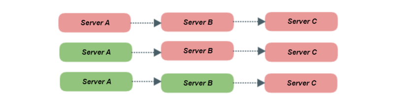

此时我们就需要对服务出现异常的情况进行隔离，防止级联故障效应，常用的隔离策略有线程池隔离和信号量隔离

### 线程池隔离

线程池隔离顾名思义就是通过Java的线程池进行隔离，B服务调用C服务给予固定的线程数量比如10个线程，如果此时C服务宕机了就算大量的请求过来，调用C服务的接口只会占用10个线程不会占用其他工作线程资源，因此B服务就不会出现级联故障

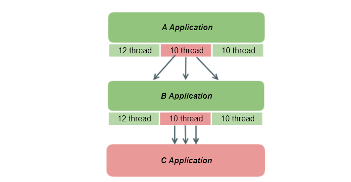

### 信号量隔离

另一种隔离信号量隔离是使用`JUC`下的Semaphore来实现的，当拿不到信号量的时候直接拒接因此不会出现超时占用其他工作线程的情况。

```
Semaphore semaphore = new Semaphore(10,true);
//获取信号量
semaphore.acquire();
//do something here
//释放信号量
semaphore.release();
```

### 比较

​线程池隔离针对不同的资源分别创建不同的线程池，不同服务调用都发生在不同的线程池中，在线程池排队、超时等阻塞情况时可以快速失败。线程池隔离的好处是隔离度比较高，可以针对某个资源的线程池去进行处理而不影响其它资源，但是代价就是线程上下文切换的 overhead 比较大，特别是对低延时的调用有比较大的影响。而信号量隔离非常轻量级，仅限制对某个资源调用的并发数，而不是显式地去创建线程池，所以 overhead 比较小，但是效果不错，也支持超时失败。

| 比较项 | 线程池隔离 | 信号量隔离 |
| --- | --- | --- |
| 线程 | 与调用线程不同，使用的是线程池创建的线程 | 与调用线程相同 |
| 开销 | 排队，切换，调度等开销 | 无线程切换性能更高 |
| 是否支持异步 | 支持 | 不支持 |
| 是否支持超时 | 支持超时 | **支持超时([新版本支持](https://www.codercto.com/a/77154.html))** |
| 并发支持 | 支持通过线程池大小控制 | 支持通过最大信号量控制 |

## 降级熔断机制

​ 什么是降级和熔断？降级和熔断有什么区别？虽然很多人把降级熔断当着一个词来说的，但是降级和熔断是完全不同的概念的，看看下面几种场景：

```
场景一：比如我们每天上班坐公交，1路和2路公交都能到公司，但是2路公交需要下车走点路，所以平时都是坐1路公交，
突然有一天等了1路公交好久都没来，于是就坐了2路公交作为替代方案总不能迟到吧！下次再等1路车。
```

```
场景二：第二天，第三天 ... 已经一个星期了都没看到1路公交，心里觉得可能是1路公交改路线了，
于是直接坐2路公交了，在接下来的日子里都是直接忽略1路车直接坐2路车
```

```
场景三：突然有一天在等2路车的时候看到了1路车，是不是1路车现在恢复了，于是天天开心的坐着1路车上班去了，领导再也不担心我迟到了
```

场景一 在1路车没等到的情况下采取降级方案坐2路车，这就是降级策略，
场景二 如果多次都没有等到1路车就直接不等了下次直接坐2路车，这就是熔断策略，
场景三 如果过段时间1路车恢复了就使用2路车，这就是熔断恢复！

### 降级机制

常用的降级策略如：熔断器降级，限流降级，超时降级，异常降级，平均响应时间降级等

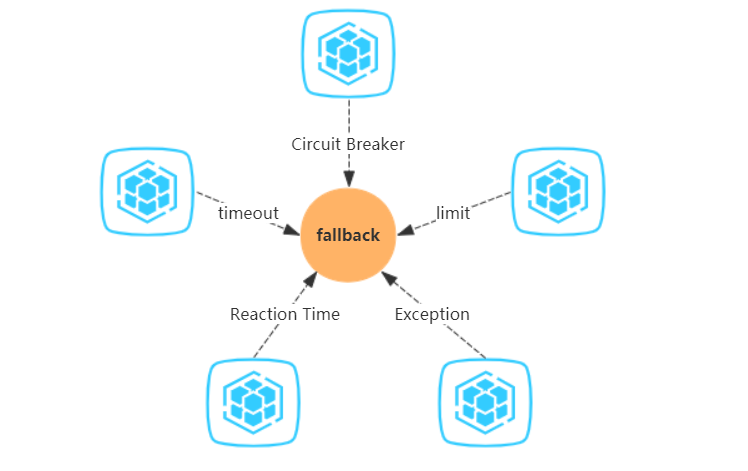

- **熔断器降级：**即熔断器开启的时间直接熔断走降级的策略
- **限流降级：**对流量进行限制达到降级的效果，如：`Hystrix`中的线程池，信号量都能达到限流的效果
- **超时降级：**课时设置对应的超时时间如果服务调用超时了就执行降级策略，如：`Hystrix`中默认为1s
- **异常降级：**异常降级很简单就是服务出现异常了执行降级策略
- **平均响应时间降级：**服务响应时间持续飙高的时候实现降级策略，如Sentinel中默认的RT 上限是 4900 ms

### 熔断机制

​ 熔断其实是一个框架级的处理，那么这套熔断机制的设计，基本上业内用的是`Martin Fowler`提出的断路器模式，断路器的基本原理非常简单。
您将受保护的函数调用包装在断路器对象中，该对象将监视故障。一旦故障达到某个阈值，断路器将跳闸，并且所有进一步的断路器调用都会返回错误，而根本不会进行受保护的调用。常见的断路器模式有基本模式和扩展模式。

**基本模式：**

- 如果断路器状态为close，则调用断路器将调用supplier服务模块；
- 如果断路器状态为open则直接返回错误；
- 如果超时，我们将增加失败计数器，成功的调用会将其重置为零；
- 通过比较故障计数和阈值来确定断路器的状态；

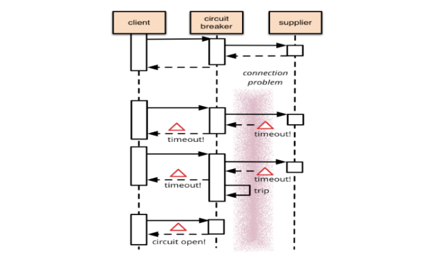

**扩展模式：**

基础模式的断路器避免了在电路断开时发出受保护的呼叫，但是当情况恢复正常时，将需要外部干预才能将其重置。对于建筑物中的电路断路器，这是一种合理的方法，但是对于软件断路器，我们可以让断路器本身检测基础调用是否再次正常工作。我们可以通过在适当的时间间隔后再次尝试受保护的调用来实现这种自我重置行为，并在成功后重置断路器。于是就出现了扩展模式：

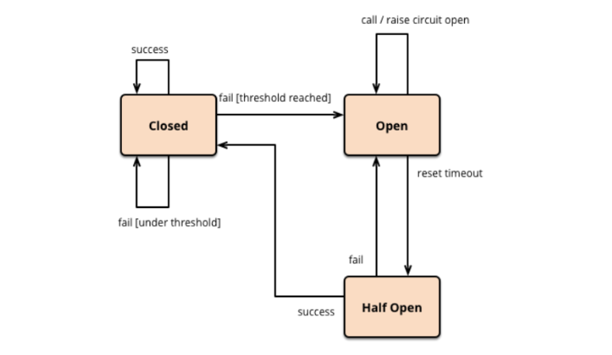

- 最开始处于`closed`状态，一旦检测到错误到达一定阈值，便转为`open`状态；
- 这时候会有个 reset timeout，到了这个时间了，会转移到`half open`状态；
- 尝试放行一部分请求到后端，一旦检测成功便回归到`closed`状态，即恢复服务；

### 熔断策略

我们通常用以下几种方式来衡量资源是否处于稳定的状态：

- 平均响应时间：如`Sentinel`中的熔断就使用了平均响应时间，当 1s 内持续进入 5 个请求，对应时刻的平均响应时间（秒级）均超过阈值（`count`，以 ms 为单位），那么在接下的时间窗口之内，对这个方法的调用都会自动地熔断。
- 异常比例 ：主流的容错框架`Hystrix`和`sentinel`中都使用了异常比例熔断策略，比如当资源的每秒请求量 >= 5，并且每秒异常总数占通过量的比值超过阈值之后，资源进入熔断状态，即在接下的时间窗口之内，对这个方法的调用都会自动地返回。异常比率的阈值范围是 `[0.0, 1.0]`，代表 0% - 100%。
- 异常数：如`Sentinel`中的熔断就使用了异常数熔断策略，当资源近 1 分钟的异常数目超过阈值之后会进行熔断。注意由于统计时间窗口是分钟级别的，若 `timeWindow` 小于 60s，则结束熔断状态后仍可能再进入熔断状态。

## 限流机制

​ 限流也是提高系统的容错性的一种方案，不同的场景对“流”的定义也是不同的，可以是网络流量，带宽，每秒处理的事务数 (`TPS`)，每秒请求数 (`hits per second`)，并发请求数，甚至还可能是业务上的某个指标，比如用户在某段时间内允许的最多请求短信验证码次数。我们常说的限流都是限制每秒请求数，从分布式角度来看，限流可分为 `分布式限流` （比如基于`Sentinel`或者`Redis`的集群限流）和 `单机限流` 。从算法实现角度来看，限流算法可分为 `漏桶算法`、 `令牌桶算法` 和 `滑动时间窗口算法` 。

### 单机限流

**漏桶算法**

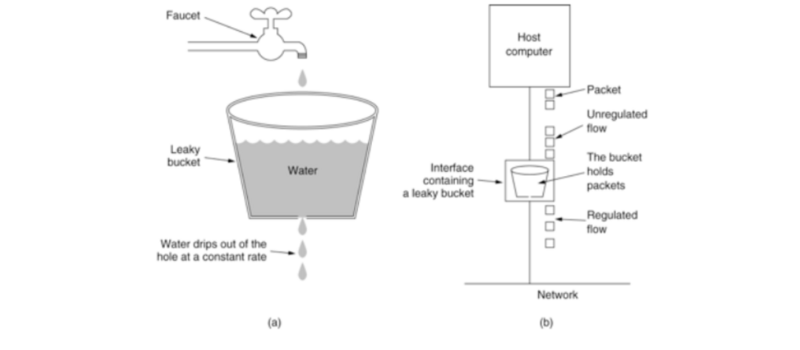

- 一个固定容量的漏桶，按照常量固定速率流出水滴；
- 如果桶是空的，则不需流出水滴；
- 可以以任意速率流入水滴到漏桶；
- 如果流入水滴超出了桶的容量，则流入的水滴溢出了（被丢弃），而漏桶容量是不变的。

**令牌桶算法**

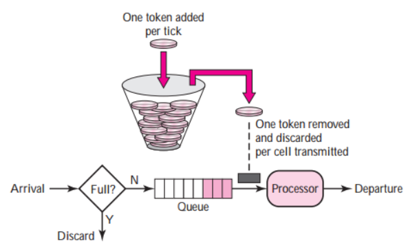

- 假设限制2r/s，则按照500毫秒的固定速率往桶中添加令牌；
- 桶中最多存放b个令牌，当桶满时，新添加的令牌被丢弃或拒绝；
- 当一个n个字节大小的数据包到达，将从桶中删除n个令牌，接着数据包被发送到网络上；
- 如果桶中的令牌不足n个，则不会删除令牌，且该数据包将被限流（要么丢弃，要么缓冲区等待）。

**固定时间窗口算法**  
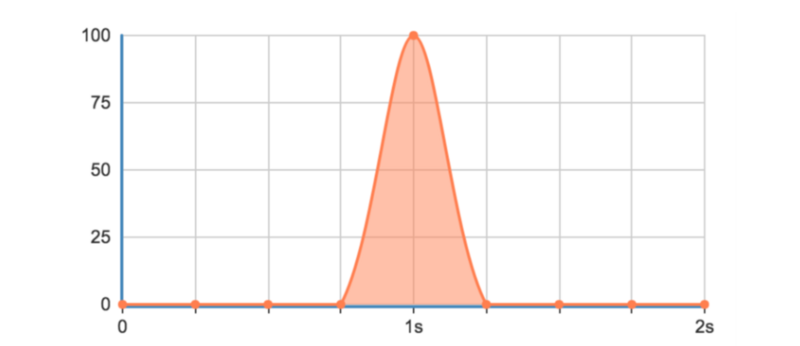

这种实现计数器限流方式由于是在一个时间间隔内进行限制，如果用户在上个时间间隔结束前请求（但没有超过限制），同时在当前时间间隔刚开始请求（同样没超过限制），在各自的时间间隔内，这些请求都是正常的，但是将间隔临界的一段时间内的请求就会超过系统限制，可能导致系统被压垮。

**滑动时间窗口算法**

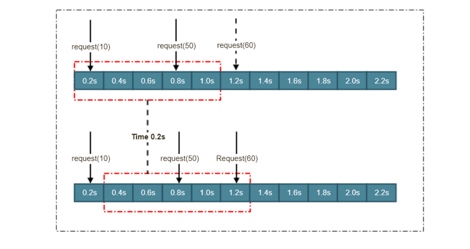

- 0、初始化，设置时间窗口，设置时间窗口时间点间隔长度；
- 1、判断请求时间点是否在时间窗口中，在进入步骤2，否则进入步骤3；
- 2、判断是否超过时间窗口限流值，是->进行限流，否->对应时间窗口计数器+1；
- 3、移动当时时间窗口，移动方式是：起始时间点变为时间列表中的第二时间点，结束时间增加一个时间点。重新步骤一的判断 。

### 分布式限流

当应用为单点应用时，只要应用进行了限流，那么应用所依赖的各种服务也都得到了保护。 但线上业务出于各种原因考虑，多是分布式系统，单节点的限流仅能保护自身节点，但无法保护应用依赖的各种服务，并且在进行节点扩容、缩容时也无法准确控制整个服务的请求限制。

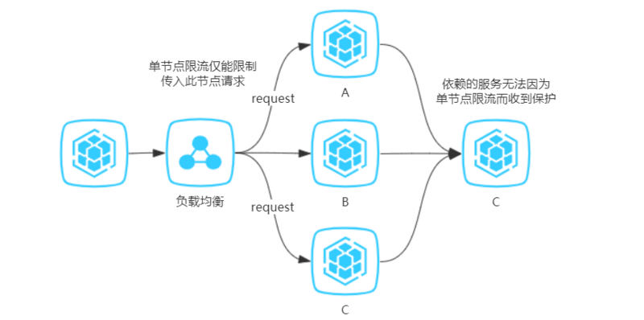

如果实现了分布式限流，那么就可以方便地控制整个服务集群的请求限制，且由于整个集群的请求数量得到了限制，因此服务依赖的各种资源也得到了限流的保护。

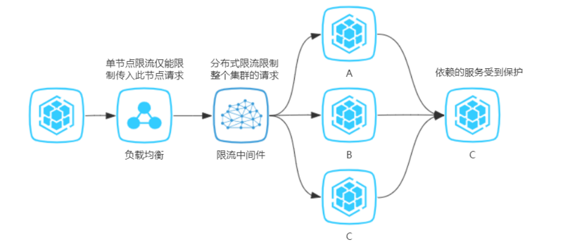

**分布式限流方案**

分布式限流的思想我列举下面三个方案：

**1，`Redis`令牌桶**

这种方案是最简单的一种集群限流思想。在本地限流中，我们使用Long的原子类作令牌桶，当实例数量超过1，我们就考虑将`Redis`用作公共内存区域，进行读写。涉及到的并发控制，也可以使用`Redis`实现分布式锁。

**缺点：**每取一次令牌都会进行一次网络开销，而网络开销起码是毫秒级，所以这种方案支持的并发量是非常有限的。

**2，`QPS`统一分配**

这种方案的思想是将集群限流最大程度的本地化。

举个例子，我们有两台服务器实例，对应的是同一个应用程序（`Application.name`相同），程序中设置的`QPS`为100，将应用程序与同一个控制台程序进行连接，控制台端依据应用的实例数量将`QPS`进行均分，动态设置每个实例的`QPS`为50，若是遇到两个服务器的配置并不相同，在负载均衡层的就已经根据服务器的优劣对流量进行分配，例如一台分配70%流量，另一台分配30%的流量。面对这种情况，控制台也可以对其实行加权分配`QPS`的策略。

**缺点：**

这也算一种集群限流的实现方案，但依旧存在不小的问题。该模式的分配比例是建立在大数据流量下的趋势进行分配，实际情况中可能并不是严格的五五分或三七分，误差不可控，极容易出现用户连续访问某一台服务器遇到请求驳回而另一台服务器此刻空闲流量充足的尴尬情况。

**3，发票服务器**

这种方案的思想是建立在`Redis`令牌桶方案的基础之上的。如何解决每次取令牌都伴随一次网络开销，该方案的解决方法是建立一层控制端，利用该控制端与`Redis`令牌桶进行交互，只有当客户端的剩余令牌数不足时，客户端才向该控制层取令牌并且每次取一批。

**缺点：**
这种思想类似于Java集合框架的数组扩容，设置一个阈值，只有当超过该临界值时，才会触发异步调用。其余存取令牌的操作与本地限流无二。虽然该方案依旧存在误差，但误差最大也就一批次令牌数而已。

## 参考

1，[https://www.cnblogs.com/rjzhe...](https://www.cnblogs.com/rjzheng/p/10340176.html)  
2，[https://www.martinfowler.com/...](https://www.martinfowler.com/bliki/CircuitBreaker.html)  
3，[https://www.cnblogs.com/babyc...](https://www.cnblogs.com/babycomeon/p/11216538.html)  
4，[https://github.com/alibaba/Se...](https://github.com/alibaba/Sentinel/wiki/Sentinel-%E4%B8%8E-Hystrix-%E7%9A%84%E5%AF%B9%E6%AF%94)  
5，[https://www.jishuwen.com/d/2TX1](https://www.jishuwen.com/d/2TX1)  
6，[https://juejin.im/post/5c74a2...](https://juejin.im/post/5c74a2e2f265da2dea053355)  
7，[https://www.jianshu.com/p/259...](https://www.jianshu.com/p/2596e559db5c)  
8，[https://zhuanlan.zhihu.com/p/...](https://zhuanlan.zhihu.com/p/48965194)