# Java生产环境下性能监控与调优详解笔记


另一个整理<http://alanhou.org/java-optimization/>

## 1：JVM字节码指令与 javap 
```bash
javap <options> <classes>
cd monitor\_tuning/target/classes/org/alanhou/monitor\_tuning/chapter8/
javap -verbose Test1.class > Test1.txt
```

即可保存字节码文件
会有三个部分组成
操作数栈
LineNumberTable
LocalVariableTable

i++和++i 的执行效果完全相同 多了一个压入栈顶操作
for(int i=0;i<10;i++) {} 
for(int i=0;i<10;++i) {} 执行效果一样

2：

public static void f1() {  
String src = "";  
for(int i=0;i<10;i++) {  
//每一次循环都会new一个StringBuilder 然后在src.append("A");  
src = src + "A";  
}  
System.out.println(src);  
}  
public static void f2() {  
//只要一个StringBuilder  
StringBuilder src = new StringBuilder();  
for(int i=0;i<10;i++) {  
src.append("A");  
}  
System.out.println(src);  
}

3：

public static String f1() {  
String str = "hello";  
try{  
return str;  
}  
finally{  
str = "imooc";  
}  
} 返回 hello 但会执行finally 中的代码

4：字符串拼接都会在编译阶段转换成stringbuilder

5:字符串去重

字符串在任何应用中都占用了大量的内存。尤其数包含独立UTF-16字符的char\[\]数组对JVM内存的消耗贡献最多——因为每个字符占用2位。

内存的30%被字符串消耗其实是很常见的，不仅是因为字符串是与我们互动的最好的格式，而且是由于流行的HTTP API使用了大量的字符串。使用Java 8 Update 20，我们现在可以接触到一个新特性，叫做字符串去重，该特性需要G1垃圾回收器，该垃圾回收器默认是被关闭的。

字符串去重利用了字符串内部实际是char数组，并且是final的特性，所以JVM可以任意的操纵他们。

对于字符串去重，开发者考虑了大量的策略，但最终的实现采用了下面的方式：

无论何时垃圾回收器访问了String对象，它会对char数组进行一个标记。它获取char数组的hash value并把它和一个对数组的弱引用存在一起。只要垃圾回收器发现另一个字符串，而这个字符串和char数组具有相同的hash code，那么就会对两者进行一个字符一个字符的比对。

如果他们恰好匹配，那么一个字符串就会被修改，指向第二个字符串的char数组。第一个char数组就不再被引用，也就可以被回收了。

这整个过程当然带来了一些开销，但是被很紧实的上限控制了。例如，如果一个字符未发现有重复，那么一段时间之内，它会不再被检查。

那么该特性实际上是怎么工作的呢？首先，你需要刚刚发布的Java 8 Update 20，然后按照这个配置: -Xmx256m -XX:+UseG1GC 去运行下列的代码:

```java
public class LotsOfStrings {
    private static final LinkedList LOTS_OF_STRINGS = new LinkedList<>();

    public static void main(String[] args) throws Exception {
        int iteration = 0;
        while (true) {
            for (int i = 0; i < 100; i++) {
                for (int j = 0; j < 1000; j++) {
                    LOTS_OF_STRINGS.add(new String("String " + j));
                }
            }
            iteration++;
            System.out.println("Survived Iteration: " + iteration);
            Thread.sleep(100);
        }
    }
}
```

这段代码会执行30个迭代之后报OutOfMemoryError。

现在，开启字符串去重，使用如下配置去跑上述代码：

-Xmx256m -XX:+UseG1GC -XX:+UseStringDeduplication -XX:+PrintStringDeduplicationStatistics

此时它已经可以运行更长的时间，而且在50个迭代之后才终止。

6:

ArrayLIst  底层是数组  扩容会拷贝  
hashmap   底层也是数组+ 链表 扩容 重新计算key 负载因子是 0.75  
  
linklist底层是双向链表  
1\. 尽量重用对象，不要循环创建对象，比如:for 循环字符串拼接(不在 for中使用+拼接，先new 一个StringBuilder再在 for 里 append)  
  
2\. 容器类初始化的地时候指定长度  
  
List<String> collection = new ArrayLIst<String>(5);  
  
Map<String, String> map = new HashMap<String, String>(32);  
  
3\. ArrayList（底层数组）随机遍历快，LinkedList（底层双向链表）添加删除快  
  
4\. 集合遍历尽量减少重复计算  
  
5\. 使用 Entry 遍历 Map可以同时取出key和value  
  
6\. 大数组复制使用System.arraycopy 底层是native实现的  
  
7\. 尽量使用基本类型而不是包装类型  
  
public class Test03 {  
  
  public static void main(String\[\] args) {  
  Integer f1 = 100, f2 = 100, f3 = 150, f4 = 150;  
  
  System.out.println(f1 == f2);  
  System.out.println(f3 == f4);  
}  
}  
  
如果不明就里很容易认为两个输出要么都是true要么都是false。首先需要注意的是f1、f2、f3、f4四个变量都是Integer对象引用，所以下面的==运算比较的不是值而是引用。装箱的本质是什么呢？当我们给一个Integer对象赋一个int值的时候，会调用Integer类的静态方法valueOf，如果看看valueOf的源代码就知道发生了什么。  
public static Integer valueOf(int i) {  
  if (i >= IntegerCache.low && i <= IntegerCache.high)  
    return IntegerCache.cache\[i + (-IntegerCache.low)\];  
  return new Integer(i);  
}  
简单的说，如果整型字面量的值在-128到127之间，那么不会new新的Integer对象，而是直接引用常量池中的Integer对象，所以上面的面试题中f1==f2的结果是true，而f3==f4的结果是false。  
8\. 不要手动调用 System.gc()  
  
9\. 及时消除过期对象的引用，防止内存泄漏  
public string pop()  
{  
  string currentValue=object\[size\];  
  //object\[size\]=null;如果不添加这句话就会造成内存泄漏  
  size--;  
  return currentValue;  
}  
  
10\. 尽量使用局部变量，减小变量的作用域 方便出了作用域尽快垃圾回收  
  
11\. 尽量使用非同步的容器ArraryList vs. Vector  
  
12\. 尽量减小同步作用范围, synchronized 方法 vs. 代码块  
  
  
public class SynchronizedTest {  
  public static void main(String\[\] args) {  
}  
public synchronized void f1() {//在this對象上加鎖  
  System.out.println("f1");  
}  
public  void f2() {//在this對象上加鎖  
  synchronized(this) {  
    System.out.println("f2");  
  }  
}  
public static synchronized void f3() {//在类上加鎖  
  System.out.println("f3");  
}  
public static void f4() {//在类上加鎖  
  synchronized(SynchronizedTest.class) {  
    System.out.println("f4");  
  }  
}  
}  
  
13\. 用ThreadLocal 缓存线程不安全的对象，SimpleDateFormat 缓存重量的对象避免重新构造  
@SuppressWarnings("rawtypes")  
    private static ThreadLocal threadLocal = new ThreadLocal() {  
        protected synchronized Object initialValue() {  
            return new SimpleDateFormat(DATE_FORMAT);  
        }  
    };  
  
14\. 尽量使用延迟加载  
  
15\. 尽量减少使用反射，必须用加缓存，反射比较影响性能  
  
16\. 尽量使用连接池、线程池、对象池、缓存  
  
17\. 及时释放资源， I/O 流、Socket、数据库连接  
  
18\. 慎用异常，不要用抛异常来表示正常的业务逻辑，异常也是比较重的对象要记录堆栈信息  
  
19\. String 操作尽量少用正则表达式 比如replaceAll是用正则 比较耗费性能 replace就不是用正则  
  
20\. 日志输出注意使用不同的级别  
  
21\. 日志中参数拼接使用占位符  
log.info("orderId:" + orderId); 不推荐 会用字符串拼接  
log.info("orderId:{}", orderId); 推荐 用占位符 不会进行字符串拼接  
  
  
7：JVM的参数类型

标准参数（各版本中保持稳定）

-help

-server -client

-version -showversion

-cp -classpath

X 参数（非标准化参数）

-Xint：解释执行

-Xcomp：第一次使用就编译成本地代码

-Xmixed：混合模式，JVM 自己决定是否编译成本地代码

示例：

java -version（默认是混合模式）

Java HotSpot(TM) 64-Bit Server VM (build 25.40-b25, mixed mode)

java -Xint -version

Java HotSpot(TM) 64-Bit Server VM (build 25.40-b25, interpreted mode)

XX 参数（非标准化参数）

主要用于 JVM调优和 debug

- Boolean类型
    

格式：-XX:\[+-\]<name>表示启用或禁用 name 属性
如：-XX:+UseConcMarkSweepGC
-XX:+UseG1GC

- 非Boolean类型
    

格式：-XX:<name>=<value>表示 name 属性的值是 value
如：-XX:MaxGCPauseMillis=500
-xx:GCTimeRatio=19
-Xmx -Xms属于 XX 参数
-Xms 等价于-XX:InitialHeapSize
-Xmx 等价于-XX:MaxHeapSize
-xss 等价于-XX:ThreadStackSize

### 查看

-XX:+PrintFlagsInitial 查看jvm初始值

-XX:+PrintFlagsFinal 查看jvm最终值

-XX:+UnlockExperimentalVMOptions 解锁实验参数

-XX:+UnlockDiagnosticVMOptions 解锁诊断参数

-XX:+PrintCommandLineFlags 打印命令行参数

输出结果中=表示默认值，:=表示被用户或 JVM 修改后的值

示例：java -XX:+PrintFlagsFinal -version

补充：测试中需要用到 Tomcat，CentOS 7安装示例如下

`sudo `yum -y ``install java-1.8.0-openjdk*
wget  http://mirror.bit.edu.cn/apache/tomcat/tomcat-8/v8.5.32/bin/apache-tomcat-8.5.32.tar.gz
tar -zxvf apache-tomcat-8.5.32.tar.gz 
mv apache-tomcat-8.5.32 tomcat
cd tomcat/bin/sh startup.sh

pid 可通过类似 ps -ef|grep tomcat或 jps来进行查看

### jps

查看java进程 -l 可以知道完全类名

### jinfo

jinfo -flag MaxHeapSize <pid>

jinfo -flags <pid>  手动赋过值的参数

### jstat

可以查看jvm的统计信息 如类加载。垃圾回收信息，jit编译信息

详情参考 [jstat 官方文档](https://docs.oracle.com/javase/8/docs/technotes/tools/unix/jstat.html)


类加载

# 以下1000表每隔1000ms 即1秒，共输出10次
jstat -class <pid> 1000 10

垃圾收集

-gc, -gcutil, -gccause, -gcnew, -gcold

jstat -gc <pid> 1000 10

以下大小的单位均为 KB


S0C, S1C, S0U, S1U: S0和 S1的总量和使用量

EC, EU: Eden区总量与使用量

OC, OU: Old区总量与使用量

MC, MU: Metacspace区(jdk1.8前为 PermGen)总量与使用量

CCSC, CCSU: 压缩类区总量与使用量

YGC, YGCT: YoungGC 的次数与时间

FGC, FGCT: FullGC 的次数与时间

GCT: 总的 GC 时间

JIT 编译

-compiler, -printcompilation

一个对象默认分配在堆上面 但是有个指针指向class默认是64位长指针，可以设置为用32位存储在压缩类空间

非堆区 即对应于虚拟机规范中的方法区 是操作系统本地内存 独立于jvm堆区之外 jdk8后面叫metaspace jdk8前面叫performancespace

codecache 存储的是jit即时编译的代码 以及native代码

### jmap+MAT

详情参考[jmap 官方文档](https://docs.oracle.com/javase/8/docs/technotes/tools/unix/jmap.html)

内存溢出演示：

https://start.spring.io/生成初始代码

最终代码：[monitor_tuning](https://github.com/alanhou7/java-codes/tree/master/monitor_tuning)

为快速产生内存溢出，右击 Run As>Run Configurations, Arguments 标签VM arguments 中填入

-Xmx32M -Xms32M

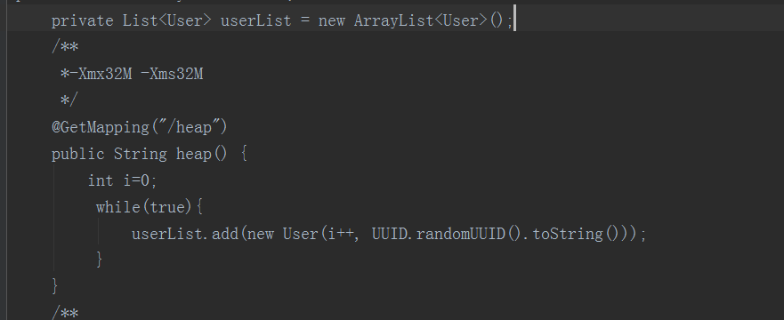

访问 http://localhost:8080/heap

Exception in thread "http-nio-8080-exec-2" Exception in thread "http-nio-8080-exec-1" java.lang.OutOfMemoryError: Java heap space
java.lang.OutOfMemoryError: Java heap space

-XX:MetaspaceSize=32M -XX:MaxMetaspaceSize=32M（同时在 pom.xml 中加入 asm 的依赖）

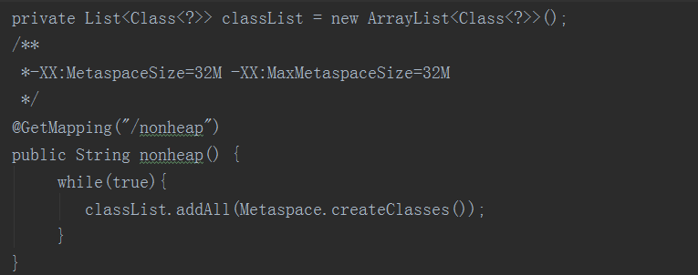

访问 http://localhost:8080/nonheap

Exception in thread "main" java.lang.OutOfMemoryError: Metaspace
Exception in thread "ContainerBackgroundProcessor\[StandardEngine\[Tomcat\]\]" java.lang.OutOfMemoryError: Metaspace

内存溢出自动导出

-XX:+HeapDumpOnOutOfMemoryError

-XX:HeapDumpPath=./

右击 Run As>Run Configurations, Arguments 标签VM arguments 中填入

-Xmx32M -Xms32M -XX:+HeapDumpOnOutOfMemoryError -XX:HeapDumpPath=./

可以看到自动在当前目录中生成了一个java_pid660.hprof文件

java.lang.OutOfMemoryError: GC overhead limit exceeded
Dumping heap to ./java_pid660.hprof ...

另一种导出溢出也更推荐的方式是jmap

option: -heap, -clstats, -dump:<dump-options>, -F

jmap -dump:format=b,file=heap.hprof <pid>

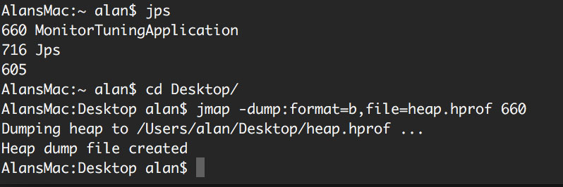

MAT下载地址：http://www.eclipse.org/mat/

找开上述导出的内存溢出文件即可进行分析，如下图的溢出源头分析：

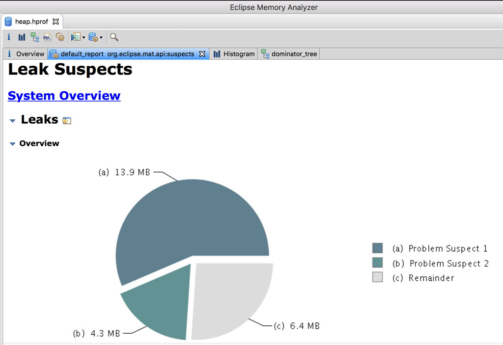

1. Histogram可以列出内存中的对象，对象的个数以及大小。
2. Dominator Tree可以列出那个线程，以及线程下面的那些对象占用的空间。

Histogram

    [](http://static.oschina.net/uploads/space/2014/0702/120039_qSi5_1767531.png)

- Class Name ： 类名称，java类名
    
- Objects ： 类的对象的数量，这个对象被创建了多少个
    
- Shallow Heap ：一个对象内存的消耗大小，不包含对其他对象的引用
    

- Retained Heap ：是shallow Heap的总和，也就是该对象被GC之后所能回收到内存的总和
    

Dominator Tree

[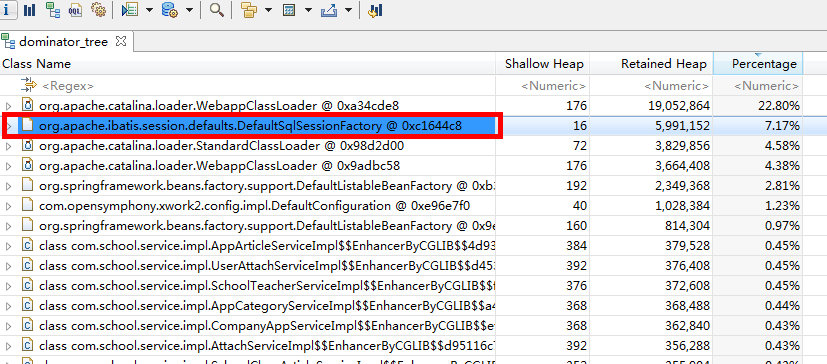](http://static.oschina.net/uploads/space/2014/0702/145926_K3ET_1767531.png)

我们可以看到ibatis占了较多内存

快速找出某个实例没被释放的原因，可以右健 Path to GC Roots-->exclue all phantom/weak/soft etc. reference :

 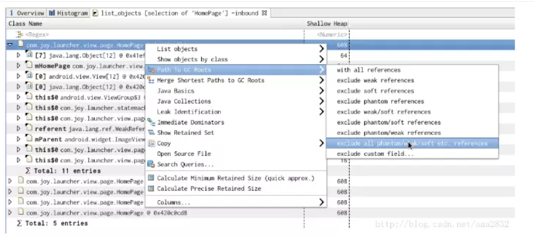

得到的结果是：


从表中可以看出 PreferenceManager -> … ->HomePage这条线路就引用着这个 HomePage实例。用这个方法可以快速找到某个对象的 **GC Root**,一个存在 GC Root的对象是不会被 GC回收掉的.

### jstack

详情参考 [jstack 官方文档](https://docs.oracle.com/javase/8/docs/technotes/tools/unix/jstack.html)

jstack <pid>  打印jvm内部所有的线程

 *jstack 15672 >15673.txt  导出当前进程文件*

可查看其中包含java.lang.Thread.State: WAITING (parking)，JAVA 线程包含的状态有：

NEW：线程尚未启动

RUNNABLE：线程正在 JVM 中执行

BLOCKED：线程在等待监控锁(monitor lock)

WAITING：线程在等待另一个线程进行特定操作（时间不确定）

TIMED_WAITING：线程等待另一个线程进行限时操作

TERMINATED：线程已退出

此时会生成一个monitor_tuning-0.0.1-SNAPSHOT.jar的 jar包，为避免本地的 CPU 消耗过多导致死机，建议上传上传到虚拟机进行测试

nohup java -jar monitor_tuning-0.0.1-SNAPSHOT.jar &

访问 http://xx.xx.xx.xx:12345/loop(端口12345在application.properties文件中定义)

top 是查询所有进程的cpu 占用率  
top还可以用来显示一个进程中各个线程CPU的占用率：top -p <pid> -H  
top命令如下  
  

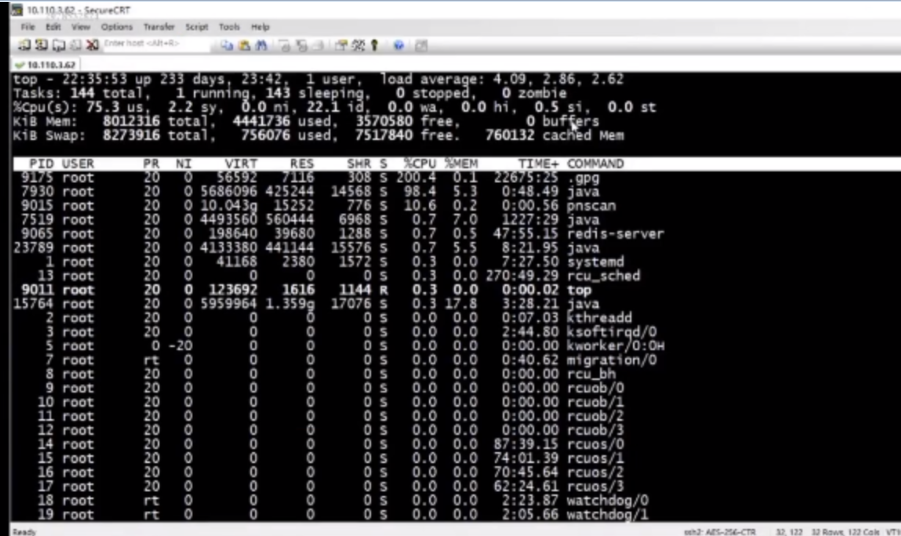

top -p <pid>  -H 命令如下 看的是7930的进程

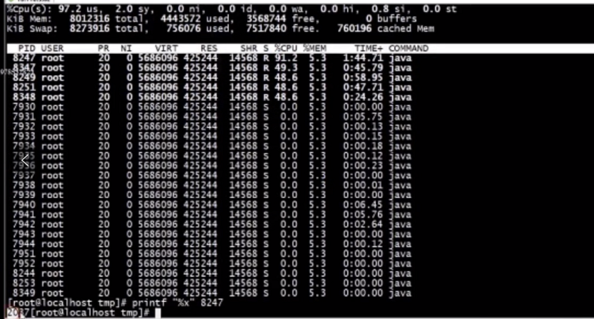

使用 jstack <pid>可以导出追踪文件，文件中 PID 在 jstack 中显示的对应 nid 为十六进制(命令行可执行 print '%x' <pid>可以进行转化，如1640对应的十六进制为668)

"http-nio-12345-exec-3" #18 daemon prio=5 os_prio=0 tid=0x00007f10003fb000 nid=0x668 runnable \[0x00007f0fcf8f9000\]
   java.lang.Thread.State: RUNNABLE
	at org.alanhou.monitor_tuning.chapter2.CpuController.getPartneridsFromJson(CpuController.java:77)
...

访问http://xx.xx.xx.xx:12345/deadlock(如上jstack <pid>导出追踪记录会发现如下这样的记录)

 

  
Java stack information for the threads listed above:
===================================================
"Thread-5":
	at org.alanhou.monitor_tuning.chapter2.CpuController.lambda$deadlock$1(CpuController.java:41)
	- waiting to lock <0x00000000edcf3470> (a java.lang.Object)
	- locked <0x00000000edcf3480> (a java.lang.Object)
	at org.alanhou.monitor_tuning.chapter2.CpuController$$Lambda$337/547045985.run(Unknown Source)
	at java.lang.Thread.run(Thread.java:748)
"Thread-4":
	at org.alanhou.monitor_tuning.chapter2.CpuController.lambda$deadlock$0(CpuController.java:33)
	- waiting to lock <0x00000000edcf3480> (a java.lang.Object)
	- locked <0x00000000edcf3470> (a java.lang.Object)
	at org.alanhou.monitor_tuning.chapter2.CpuController$$Lambda$336/1704575158.run(Unknown Source)
	at java.lang.Thread.run(Thread.java:748)

Found 1 deadlock.

查看后台日志，都是使用tail -f catalina.out命令来查看  
  

jvisualvm 图形化工具  
插件安装Tools>Plugins>Settings根据自身版本(java -version)更新插件中心地址，各版本查询地址：  
http://visualvm.github.io/pluginscenters.html  
 建议安装：Visual GC, BTrace Workbench  
概述 监控可以堆dump 线程可以线程dump 抽样器可以对cpu和内存进行抽样调查

以上是本地的JAVA进程监控，还可以进行远程的监控，在上图左侧导航的 Applications 下的 Remote 处右击Add Remote Host...，输入主机 IP 即可添加，在 IP 上右击会发现有两种连接 JAVA 进程进行监控的方式:JMX, jstatd

bin/catalina.sh(以192.168.0.5为例)

JAVA\_OPTS="$JAVA\_OPTS -Dcom.sun.management.jmxremote -Dcom.sun.management.jmxremote.port=9004 -Dcom.sun.management.jmxremote.authenticate=false -Dcom.sun.management.jmxremote.ssl=false -Djava.net.preferIPv4Stack=true -Djava.rmi.server.hostname=192.168.0.5"

启动tomcat，

启动tomcat服务  
方式一：直接启动 ./startup.sh  
方式二：作为服务启动 nohup ./startup.sh &  
查看tomcat运行日志  
tail -f catalina.out

tomcat设置jvm参数  
修改文件 apache-tomcat-9.0.10/bin下catalina.bat文件

以 JMX 为例，在 IP 上右击点击Add JMX Connection...，输入 IP:PORT

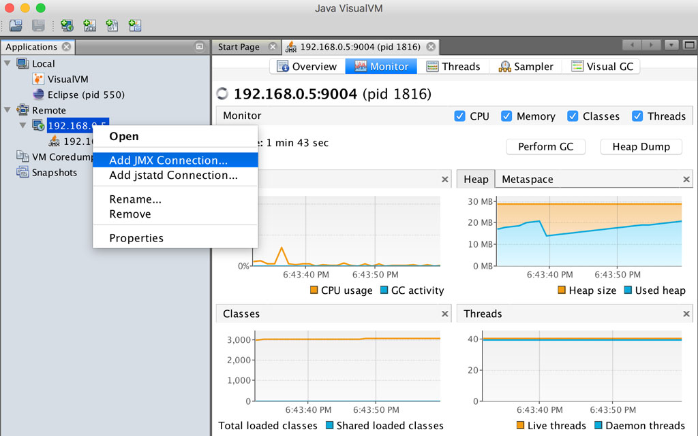

以上为 Tomcat，其它 JAVA 进程也是类似的，如：

nohup java -Dcom.sun.management.jmxremote -Dcom.sun.management.jmxremote.port=9005 -Dcom.sun.management.jmxremote.local.only=false -Dcom.sun.management.jmxremote.authenticate=false -Dcom.sun.management.jmxremote.ssl=false -Djava.net.preferIPv4Stack=true -Djava.rmi.server.hostname=192.168.0.5 -jar monitor_tuning-0.0.1-SNAPSHOT.jar &

###  BTrace

[BTrace](https://github.com/jbachorik/btrace/releases/latest) 可以动态地向目标应用程序的字节码注入追踪代码，使用的技术有 JavaCompilerApi, JVMTI, Agent, Instrumentation+ASM

使用方法：JVisualVM中添加 BTrace 插件

方法二：btrace <pid> <trace_script>

btrace只能调试本地进程  
btrace修改后的字节码不能被还原

pom.xml 中添加 btrace-agent, btrace-boot, btrace-client的依赖

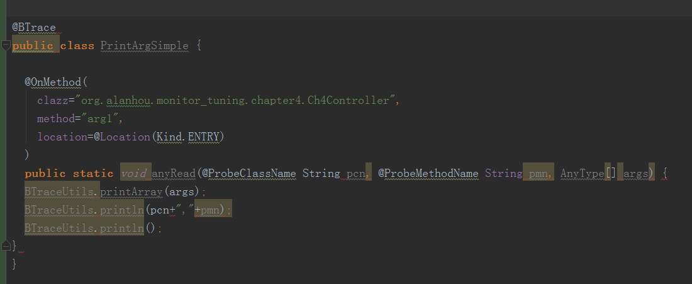

  
  

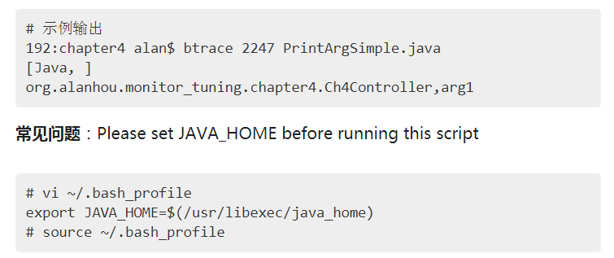

拦截构造方法

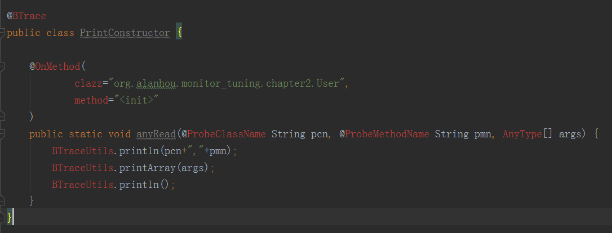

拦截同名方法  
  

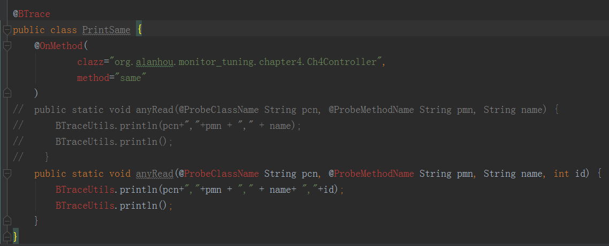

拦截返回值  
  


拦截行号


拦截异常信息


拦截复杂类型

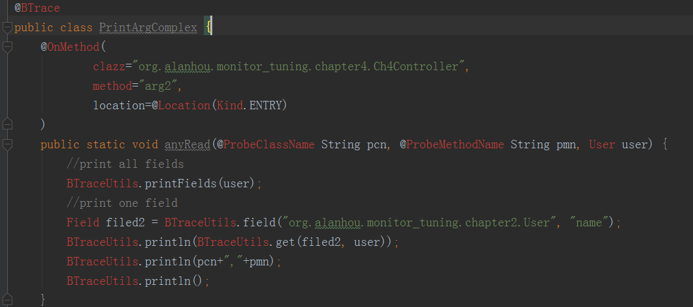

拦截正则表达式

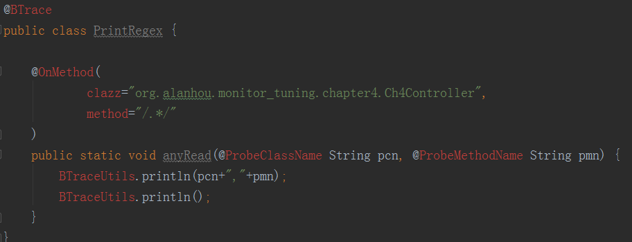

拦截环境参数信息  
  

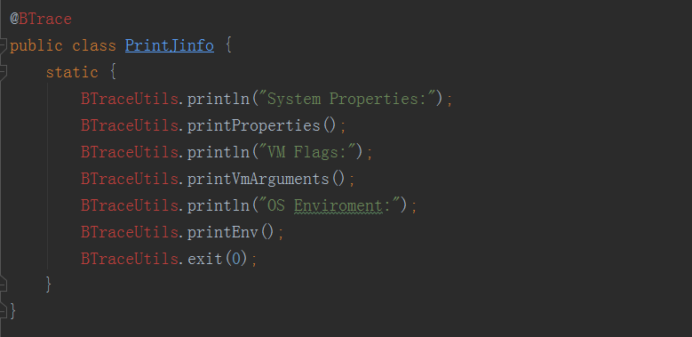  
  
  

常用参数：  
  
-Xms -Xmx  
  
-XX:NewSize -XX:MaxNewSize  
  
-XX:NewRatio -XX:SurvivorRatio  
  
-XX:MetaspaceSize -XX:MaxMetaspaceSize 以下几个参数通常这样只设置这个值即可  
  
-XX:+UseCompressedClassPointers  
  
-XX:CompressedClassSpaceSize  
  
-XX:InitialCodeCacheSize  
  
-XX:ReservedCodeCacheSize

  
  

Tomcat 远程 Debug

JDWP

bin/startup.sh 修改最后一行(添加 jpda)

exec "$PRGDIR"/"$EXECUTABLE" jpda start "$@"

bin/catalina.sh 为便于远程调试进行如下修改

JPDA_ADDRESS="localhost:8000"
# 修改为
JPDA_ADDRESS="54321"

若发现54321端口启动存在问题可尝试bin/catalina.sh jpda start

  

使用 Eclipse 远程调试，右击 Debug As > Debug Configurations... > Remote Java Application > 右击 New 新建

普通java进程可以这样配置   
java -jar -Xdebug -Xrunjdwp:transport=dt_socket,server=y,suspend=n,address=10001 access-10000.jar

  

tomcat-manager 监控

1.conf/tomcat-users.xml添加用户

  <role rolename="tomcat"/>
  <role rolename="manager-status"/>
  <role rolename="manager-gui"/>
  <user username="tomcat" password="123456" roles="tomcat,manager-gui,manager-status"/>

2.conf/Catalina/localhost/manager.xml配置允许的远程连接

<?xml version="1.0" encoding="UTF-8"?>
<Context privileged="true" antiResourceLocking="false"
        docBase="$(catalina.home)/webapps/manager">
  <Valve className="org.apache.catalina.valves.RemoteAddrValve"
        allow="127\\.0\\.0\\.1" />
</Context>

远程连接将allow="127\\.0\\.0\\.1"修改为allow="^.*$"，浏览器中输入http://127.0.0.1:8080/manage或对应的 IP，用户名密码为tomcat-users.xml中所设置的

3.重启 Tomcat 服务

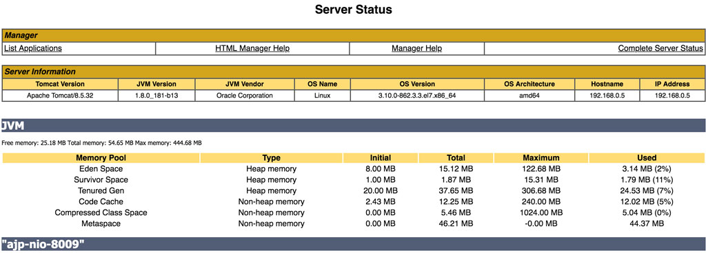

psi-probe 监控

下载地址：https://github.com/psi-probe/psi-probe，

下载后进入psi-probe-master目录，执行：

mvn clean package -Dmaven.test.skip

将 web/target/probe.war放到 Tomcat 的 webapps 目录下，同样需要conf/tomcat-users.xml和conf/Catalina/localhost/manager.xml中的配置（可保持不变），启动 Tomcat 服务

浏览器中输入http://127.0.0.1:8080/probe或对应的 IP，用户名密码为tomcat-users.xml中所设置的

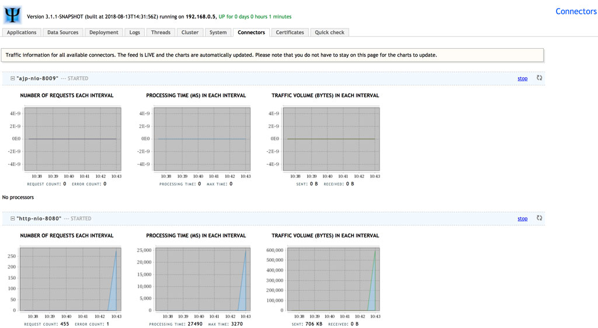

  

Tomcat 调优

线程优化（webapps/docs/config/http.html）：

maxConnections

acceptCount

maxThreads

minSpareThreads

配置优化（webapps/docs/config/host.html）：

autoDeploy

enableLookups（http.html）

reloadable（context.html）

protocol="org.apache.coyote.http11.Http11AprProtocol"

Session 优化：

如果是 JSP, 可以禁用 Session

  

### Nginx 性能监控与调优

Nginx 安装

添加 yum 源（/etc/yum.repos.d/nginx.repo）

\[nginx\]
name=nginx repo
baseurl=http://nginx.org/packages/centos/7/$basesearch/
gpgcheck=0
enabled=1

安装及常用命令

yum install -y nginx

systemctl status|start|stop|reload|restart nginx  
nginx -s stop|reload|quit|reopen  nginx  启动nginx  
cat default.conf | grep -v "#' > default2.conf  移除配置文件中的注释 并生成新的配置文件  
nginx -V  
nginx -t

配置反向代理 setenforce 0

ngx\_http\_stub_status 监控连接信息

location = /nginx_status {
    stub_status on;
    access_log off;
    allow 127.0.0.1;
    deny all;
}

可通过curl http://127.0.0.1/nginx_status 进行查看或注释掉 allow 和 deny 两行使用 IP 进行访问

ngxtop监控请求信息

查看官方使用方法：https://github.com/lebinh/ngxtop

# 安装 python-pip
yum install epel-release
yum install python-pip
# 安装 ngxtop
pip install ngxtop

使用示例

指定配置文件：ngxtop -c /etc/nginx/nginx.conf

查询状态是200：ngxtop -c /etc/nginx/nginx.conf -i 'status == 200'

查询访问最多 ip：ngxtop -c /etc/nginx/nginx.conf -g remote_addr


Nginx 优化

增加工作线程数和并发连接数

worker_processes  4; # 一般CPU 是几核就设置为几
events {
    worker_connections  1024; # 每个进程打开的最大连接数，包含了 Nginx 与客户端和 Nginx 与 upstream 之间的连接
    multi_accept on; # 可以一次建立多个连接
    use epoll;
}

启用长连接

upstream server_pool{
    server localhost:8080 weight=1 max\_fails=2 fail\_timeout=30s;
    server localhost:8081 weight=1 max\_fails=2 fail\_timeout=30s;
    keepalive 300; # 300个长连接
}
location / {
    proxy\_http\_version 1.1;
    proxy\_set\_header Upgrade $http_upgrade;
    proxy\_set\_header Connection "upgrade";
    proxy\_pass http://server\_pool;
}

启用缓存压缩

gzip on;
gzip\_http\_version 1.1;
gzip_disable "MSIE \[1-6\]\\.(?!.*SV1)";
gzip_proxied any;
gzip_types text/plain text/css application/javascript application/x-javascript application/json application/xml application/vnd.ms-fontobject application/x-font-ttf application/svg+xml application/x-icon;
gzip_vary on;
gzip_static on;

操作系统优化

# 配置文件/etc/sysctl.conf
sysctl -w net.ipv4.tcp_syncookies=1 # 防止一个套接字在有过多试图连接到时引起过载
sysctl -w net.core.somaxconn=1024 # 默认128，连接队列
sysctl -w net.ipv4.tcp\_fin\_timeout=10 # timewait 的超时时间
sysctl -w net.ipv4.tcp\_tw\_reuse=1 # os 直接使用 timewait的连接
sysctl -w net.ipv4.tcp\_tw\_recycle=0 # 回收禁用

# /etc/security/limits.conf
*               hard    nofile            204800
*               soft    nofile             204800
*               soft    core             unlimited
*               soft    stack             204800

其它优化

sendfile	on; # 减少文件在应用和内核之间拷贝
tcp_nopush	on; # 当数据包达到一定大小再发送
tcp_nodelay	off; # 有数据随时发送