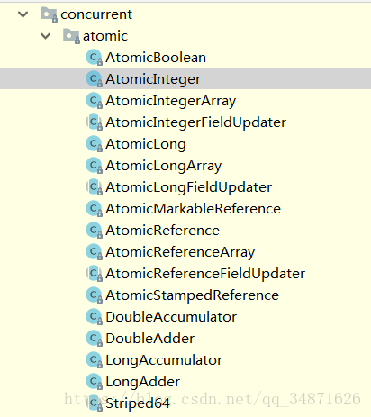
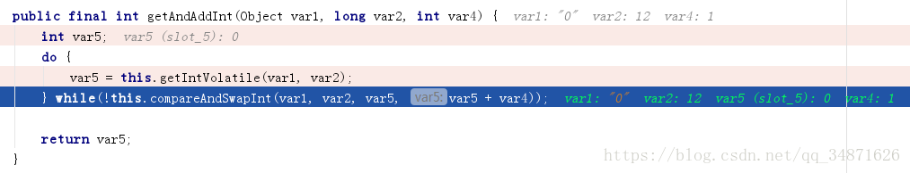
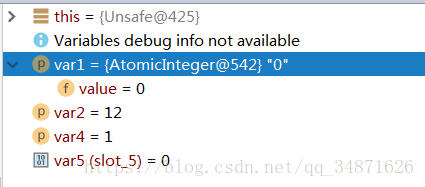
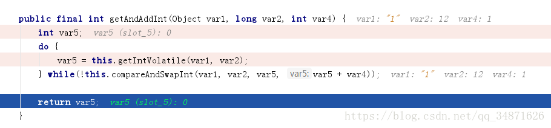
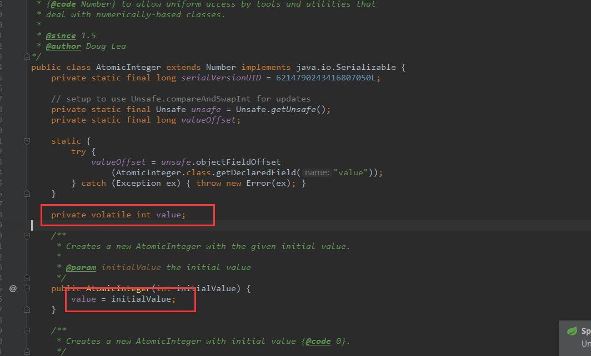
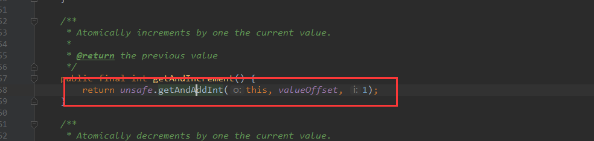
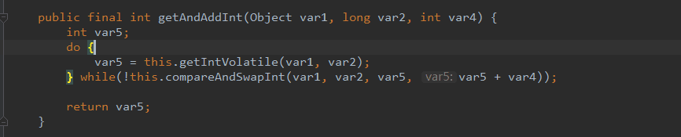
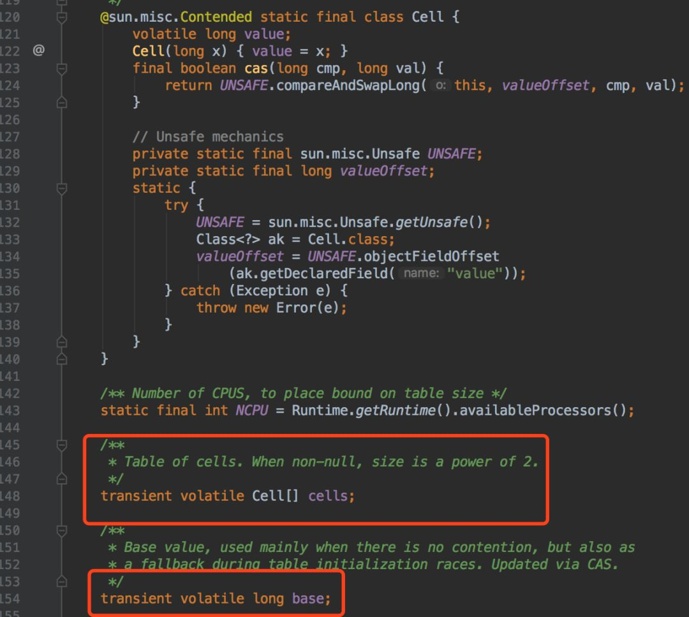

> 转载自[Java并发编程之原子性-Atomic详解](https://blog.csdn.net/qq_34871626/article/details/81411815)

# Atomic

## atomic包

JUC中的Atomic包详解：

Atomic包中提供了很多Atomicxxx的类：



它们都是CAS（compareAndSwap）来实现原子性。

## AtomicInteger样例

先写一个简单示例如下：

```java
@Slf4j
public class AtomicExample1 {

    // 请求总数
    public static int clientTotal = 5000;
    // 同时并发执行的线程数
    public static int threadTotal = 200;

    public static AtomicInteger count = new AtomicInteger(0);

    public static void main(String[] args) throws Exception {
        ExecutorService executorService = Executors.newCachedThreadPool();
        final Semaphore semaphore = new Semaphore(threadTotal);
        final CountDownLatch countDownLatch = new CountDownLatch(clientTotal);
        for (int i = 0; i < clientTotal ; i++) {
            executorService.execute(() -> {
                try {
                    semaphore.acquire();
                    add();
                    semaphore.release();
                } catch (Exception e) {
                    log.error("exception", e);
                }
                countDownLatch.countDown();
            });
        }
        countDownLatch.await();
        executorService.shutdown();
        log.info("count:{}", count.get());
    }
 
    private static void add() {
        count.incrementAndGet();
    }
}
```

可以发下每次的运行结果总是我们想要的预期结果5000。
说明该计数方法是线程安全的。

## AtomicInteger实现原理

我们查看下`count.incrementAndGet()`方法，它的第一个参数为对象本身，第二个参数为valueOffset是用来记录value本身在内存的编译地址的，这个记录，也主要是为了在更新操作在内存中找到value的位置，方便比较，第三个参数为常量1。：

```java
public class AtomicInteger extends Number implements java.io.Serializable {
    private static final long serialVersionUID = 6214790243416807050L;

    // setup to use Unsafe.compareAndSwapInt for updates
    private static final Unsafe unsafe = Unsafe.getUnsafe();
    private static final long valueOffset;

    static {
        try {
            valueOffset = unsafe.objectFieldOffset
                (AtomicInteger.class.getDeclaredField("value"));
        } catch (Exception ex) { throw new Error(ex); }
    }
    private volatile int value;
    ... 此处省略多个方法...
    /**
     * Atomically increments by one the current value.
     *
     * @return the updated value
     */
    public final int incrementAndGet() {
        return unsafe.getAndAddInt(this, valueOffset, 1) + 1;
    }
}
```

AtomicInteger源码里使用了一个Unsafe的类,它提供了一个**getAndAddInt**的方法，我们继续点看查看它的源码：

```java
public final class Unsafe {
    private static final Unsafe theUnsafe;

    ....此处省略很多方法及成员变量....


 public final int getAndAddInt(Object var1, long var2, int var4) {
        int var5;
        do {
            var5 = this.getIntVolatile(var1, var2);
        } while(!this.compareAndSwapInt(var1, var2, var5, var5 + var4));

        return var5;
    }

 public final native boolean compareAndSwapInt(Object var1, long var2, int var4, int var5);

 public native int getIntVolatile(Object var1, long var2);
}
```


可以看到这里使用了一个do while语句来做主体实现的。而在while语句里它的核心是调用了一个`compareAndSwapInt()`的方法。它是一个native方法，它是一个底层的方法，不是使用Java来实现的。

假设我们要执行0+1=0的操作，下面是单线程情况下各参数的值：



更新后：



compareAndSwapInt()方法的第一个参数（var1）是当前的对象，就是代码示例中的count。此时它的值为0（期望值）。
第二个值（var2）是传递的valueOffset值，它的值为12。
第三个参数（var4）就为常量1。方法中的变量参数（var5）是根据参数一和参数二valueOffset，调用底层getIntVolatile方法得到的值，此时它的值为0 。
compareAndSwapInt()想要达到的目标是对于count这个对象，如果当前的期望值var1里的value跟底层的返回的值（var5）相同的话，那么把它更新成var5+var4这个值。
不同的话重新循环取期望值（var5）直至当前值与期望值相同才做更新。compareAndSwap方法的核心也就是我们通常所说的CAS。

Atomic包下其他的类如AtomicLong等的实现原理基本与上述一样。


### AtomicInteger的代码



  
他的值是存在一个volatile的int里面。volatile只能保证这个变量的可见性。不能保证他的原子性。

可以看看getAndIncrement这个类似i++的函数，可以发现，是调用了UnSafe中的getAndAddInt。  



### UnSafe

UnSafe是何方神圣？UnSafe提供了java可以直接操作底层的能力。

进一步，我们可以发现实现方式：  



如何保证原子性：**自旋 + [CAS](http://mp.weixin.qq.com/s?__biz=MzI3NzE0NjcwMg==&mid=2650121285&idx=1&sn=7cf9b5badd6d38b57ccfbfed63d3aad1&chksm=f36bb964c41c307218914cab6c1592f649281460e4ec1f85627c1311441c8a43ee1854440552&scene=21#wechat_redirect)（乐观锁）**。在这个过程中，通过compareAndSwapInt比较更新value值，如果更新失败，重新获取旧值，然后更新。


**优缺点**


CAS相对于其他锁，不会进行内核态操作，有着一些性能的提升。但同时引入自旋，**当锁竞争较大的时候，自旋次数会增多。cpu资源会消耗很高**。  

换句话说，CAS+自旋适合使用在低并发有同步数据的应用场景。


### Java 8做出的改进和努力


在Java 8中引入了4个新的计数器类型，`LongAdder`、`LongAccumulator`、`DoubleAdder`、`DoubleAccumulator`。他们都是继承于`Striped64`

#### 在LongAdder 与AtomicLong有什么区别?


这里再介绍下LongAdder这个类，通过上述的分析，我们已经知道了AtomicLong使用CAS：
**在一个死循环内不断尝试修改目标值直到修改成功。如果在竞争不激烈的情况下，它修改成功概率很高。反之，如果在竞争激烈的情况下，修改失败的概率会很高，它就会进行多次的循环尝试，因此性能会受到一些影响。**
对于普通类型的long和double变量，jvm允许将64位的读操作或写操作拆成两个32位的操作。

LongAdder的核心思想是将热点数据分离，它可以将AtomicLong内部核心数据value分离成一个数组，每个线程访问时通过hash等算法映射到其中一个数字进行计数。而最终的计数结果则为这个数组的求和累加，其中热点数据value，它会被分离成多个单元的cell，每个cell独自维护内部的值,当前对象的实际值由所有的cell累计合成。这样,热点就进行了有效的分离,提高了并行度。LongAdder相当于在AtomicLong的基础上将单点的更新压力分散到各个节点上，在低并发的时候对base的直接更新可以很好的保障跟Atomic的性能基本一致。而在高并发的时候，通过分散提高了性能。但是如果在统计的时候有并发更新，可能会导致统计的数据有误差。

在实际高并发计数的时候，可以优先使用LongAdder。在低并行度或者需要准确数值的时候可以优先使用AtomicLong，这样反而效率更高。

下面简单的演示下Atomic包下AtomicReference简单的用法：

```java
@Slf4j
public class AtomicExample4 {

    private static AtomicReference<Integer> count = new AtomicReference<>(0);

    public static void main(String[] args) {
        count.compareAndSet(0, 2);
        count.compareAndSet(0, 1);
        log.info("count:{}", count.get());
    }
}
```
compareAndSet()分别传入的是预期值跟更新值，只有当预期值跟当前值相等时，才会将值更新为更新值；

上面的第一个方法可以将值更新为2，而第二个步中无法将值更新为1。


Atomic*遇到的问题是，只能运用于低并发场景。因此LongAddr在这基础上引入了**分段锁**的概念。可以参考《JDK8系列之LongAdder解析》一起看看做了什么。

**大概就是当竞争不激烈的时候，所有线程都是通过CAS对同一个变量（Base）进行修改，当竞争激烈的时候，会将根据当前线程哈希到对于Cell上进行修改（多段锁）。  **



可以看到大概实现原理是：通过**CAS乐观锁**保证原子性，通过**自旋**保证当次修改的最终修改成功，通过**降低锁粒度（多段锁）**增加并发性能。


## AtomicIntegerFieldUpdater

下面简单介绍下AtomicIntegerFieldUpdater 用法（利用原子性去更新某个类的实例）：

```java
@Slf4j
public class AtomicExample5 {

    private static AtomicIntegerFieldUpdater<AtomicExample5> updater =
            AtomicIntegerFieldUpdater.newUpdater(AtomicExample5.class, "count");

    @Getter
    private volatile int count = 100;

    public static void main(String[] args) {

        AtomicExample5 example5 = new AtomicExample5();

        if (updater.compareAndSet(example5, 100, 120)) {
            log.info("update success 1, {}", example5.getCount());
        }

        if (updater.compareAndSet(example5, 100, 120)) {
            log.info("update success 2, {}", example5.getCount());
        } else {
            log.info("update failed, {}", example5.getCount());
        }
    }
}
```
它可以更新某个类中指定成员变量的值。注意：修改的成员变量需要用volatile关键字来修饰，并且不能是static描述的字段。

## AtomicStampReference

AtomicStampReference 这个类它的核心是要解决CAS的ABA问题（CAS操作的时候，其他线程将变量的值A改成了B，接着又改回了A，等线程使用期望值A与当前变量进行比较的时候，发现A变量没有变，于是CAS就将A值进行了交换操作。实际上该值已经被其他线程改变过）。ABA问题的解决思路就是每次变量变更的时候，就将版本号加一。看一下它的一个核心方法compareAndSet()：

```java
public class AtomicStampedReference<V> {

    private static class Pair<T> {
        final T reference;
        final int stamp;
        private Pair(T reference, int stamp) {
            this.reference = reference;
            this.stamp = stamp;
        }
        static <T> Pair<T> of(T reference, int stamp) {
            return new Pair<T>(reference, stamp);
        }
    }
 
   ... 此处省略多个方法 ....
 
   public boolean compareAndSet(V   expectedReference,
                                 V   newReference,
                                 int expectedStamp,
                                 int newStamp) {
        Pair<V> current = pair;
        return
            expectedReference == current.reference &&
            expectedStamp == current.stamp &&
            ((newReference == current.reference &&
              newStamp == current.stamp) ||
             casPair(current, Pair.of(newReference, newStamp)));
    }
}
```
可以看到它多了一个stamp的比较，stamp的值是由每次更新的时候进行维护的。

## AtomicLongArray

再介绍下 AtomicLongArray ， 它维护了一个数组。在该数组下，我们可以选择性的已原子性操作更新某个索引对应的值。

```java
public class AtomicLongArray implements java.io.Serializable {
    private static final long serialVersionUID = -2308431214976778248L;
 
    private static final Unsafe unsafe = Unsafe.getUnsafe();
 
    ...此处省略....
 
 
    /**
     * Atomically sets the element at position {@code i} to the given value
     * and returns the old value.
     *
     * @param i the index
     * @param newValue the new value
     * @return the previous value
     */
    public final long getAndSet(int i, long newValue) {
        return unsafe.getAndSetLong(array, checkedByteOffset(i), newValue);
    }
 
    /**
     * Atomically sets the element at position {@code i} to the given
     * updated value if the current value {@code ==} the expected value.
     *
     * @param i the index
     * @param expect the expected value
     * @param update the new value
     * @return {@code true} if successful. False return indicates that
     * the actual value was not equal to the expected value.
     */
    public final boolean compareAndSet(int i, long expect, long update) {
        return compareAndSetRaw(checkedByteOffset(i), expect, update);
    }
}
```
## AtomcBoolean

最后再写一个AtomcBoolean的简单使用：

```java
@Slf4j
public class AtomicExample6 {
 
    private static AtomicBoolean isHappened = new AtomicBoolean(false);
 
    // 请求总数
    public static int clientTotal = 5000;
 
    // 同时并发执行的线程数
    public static int threadTotal = 200;
 
    public static void main(String[] args) throws Exception {
        ExecutorService executorService = Executors.newCachedThreadPool();
        final Semaphore semaphore = new Semaphore(threadTotal);
        final CountDownLatch countDownLatch = new CountDownLatch(clientTotal);
        for (int i = 0; i < clientTotal ; i++) {
            executorService.execute(() -> {
                try {
                    semaphore.acquire();
                    test();
                    semaphore.release();
                } catch (Exception e) {
                    log.error("exception", e);
                }
                countDownLatch.countDown();
            });
        }
        countDownLatch.await();
        executorService.shutdown();
        log.info("isHappened:{}", isHappened.get());
    }
 
    private static void test() {
        if (isHappened.compareAndSet(false, true)) {
            log.info("execute");
        }
    }
}
```
总结：以上就是Atomic包的基本原理及主要的使用方法。它是使用CAS来保证原子性操作，从而达到线程安全的目的。


```java
import java.util.concurrent.Semaphore;

public class RunningInTurn {


static class Worker extendsThread{
private final String name;
private final Semaphore thisSemaphore;
private final Semaphore nextSemaphore;
private int value;

public Worker(String name, Semaphore thisSemaphore, Semaphore nextSemaphore, int initialValue) {
this.name= name;
this.thisSemaphore= thisSemaphore;
this.nextSemaphore= nextSemaphore;
this.value= initialValue;
}

@Override
public void run() {
while(value <= 100) {
try{
thisSemaphore.acquire();
System.out.println(name + ":\t"+ value);
value += 2;
nextSemaphore.release();
} catch(InterruptedExceptione) {
e.printStackTrace();
}
}
}
}

public static void main(String[] args) throws InterruptedException{

Semaphorea Semaphore = newSemaphore(1);
Semaphore bSemaphore = newSemaphore(1);
Worker workerA = newWorker("a", aSemaphore, bSemaphore, 1);
Worker workerB = newWorker("b", bSemaphore, aSemaphore, 2);
bSemaphore.acquire();
workerA.start();
workerB.start();
}


}
```


```java

import java.util.Arrays;

public class PrimeNumberWithRoll {
private static int rowNum = 21;
private static int colNum = 10000_0000;
private static byte[][] bytes = newbyte[rowNum][colNum];

public static void main(String[] args) {
init();
start();
print();

}

private static void print() {
intcount = 0;
longi;
for(i = 1; count <= 10000_0000&& i <= rowNum * colNum; i++) {
if(getValue(i)) {
count++;
}
}
System.out.println(count - 1+ "\t"+ i);
}


private static void init() {
for(byte[] aByte :bytes) {
Arrays.fill(aByte, (byte) 1);
}
}


private static void start() {
longindex = 2;
while(index * index < (long) rowNum * colNum) {
boolean prime = getValue(index);
System.out.println(index + "\t"+ prime);
if(prime) {
setPrimeRoll(index, false);
}
index++;
}
}


private static void setPrimeRoll(longindex, booleanpri) {
for(longi = index + index; i < bytes.length* bytes[0].length; i += index) {
setValue(i, pri);
}
}

private static void setValue(longindex, booleanpri) {
long localIndex = index - 1;
long rowNo = localIndex / colNum;
long colNo = localIndex % colNum;
bytes[(int) rowNo][(int) colNo] = pri ?(byte) 1:(byte) 0;
}

private static boolean getValue(longindex) {
long localIndex = index - 1;
if(localIndex == 1|| localIndex == 0) {
return true;
}
long rowNo = localIndex / colNum;
long colNo = localIndex % colNum;
return bytes[(int) rowNo][(int) colNo] == 1;
}
}
```