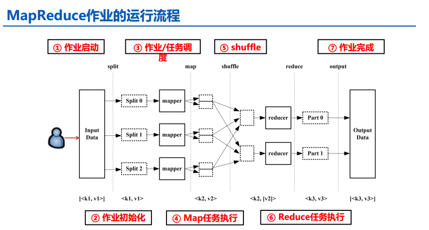
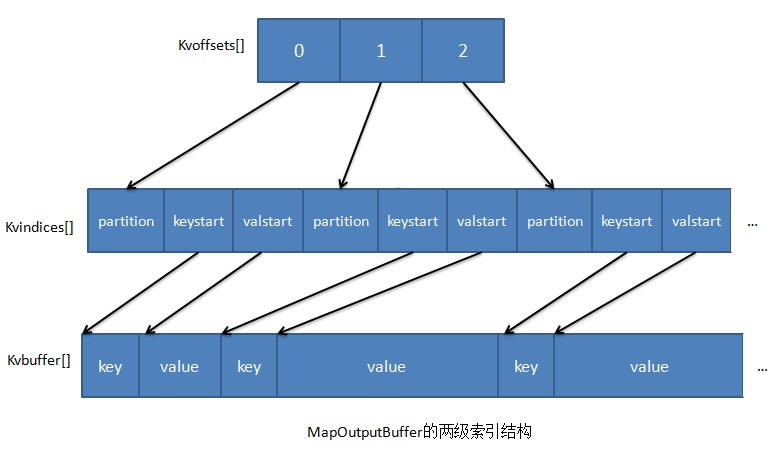
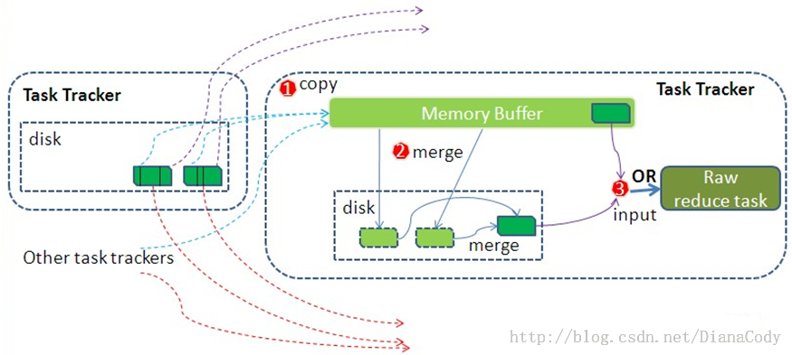
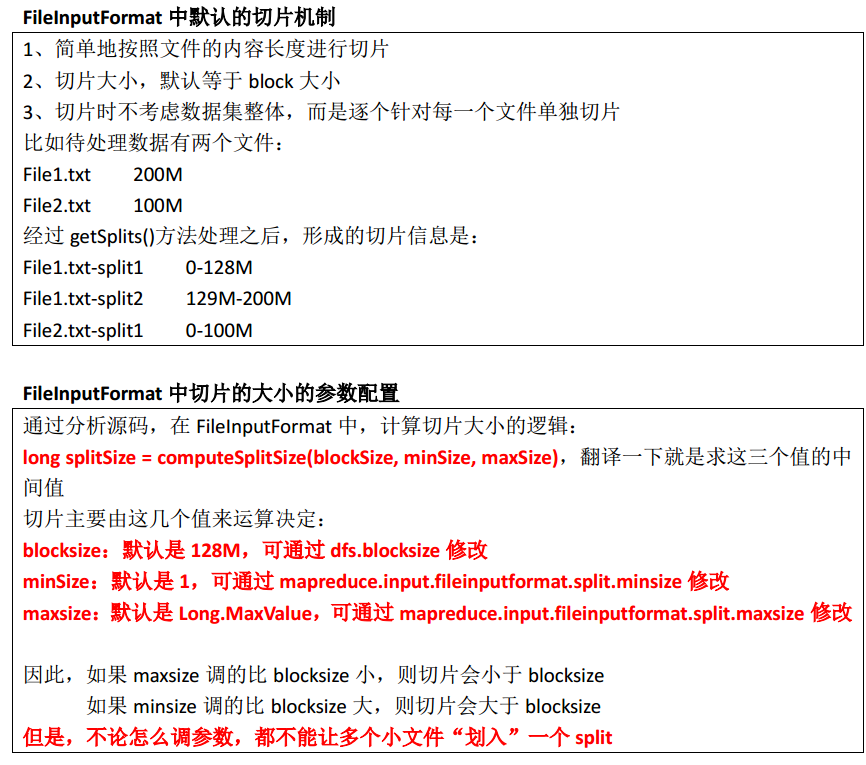
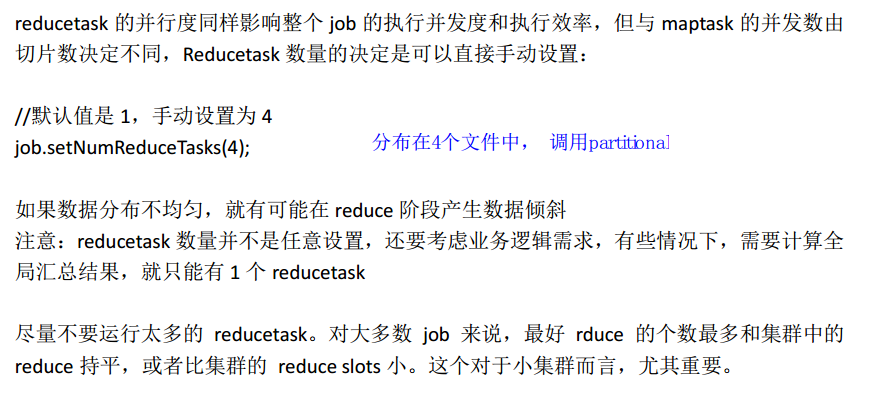

从本篇开始，陆续对常用大数据平台的原理和部分核心源码进行解读和整理。
这里的常用大数据平台包括Hadoop(HDFS、MR)、Spark、Kylin、Flink、HBase、Flume、Elastic Search等


# Hadoop专题

1. [在Docker上搭建Hadoop集群container](/distributed/docker/hadoop-cluser-in-docker/)
2. [Hadoop集群节点配置及搭建](/distributed/hadoop/hadoop-cluser-configuration/)
3. [HDFS Java API](/distributed/hadoop/HDFS-Java-API/)


## HDFS架构
- HDFS的架构
- 数据存储与交互

## MR架构

对于MapReduce作业，完整的作业运行流程，这里借用刘军老师的[Hadoop大数据处理](http://item.jd.com/11315351.html)中的一张图：



完整过程应该是分为7部分，分别是：

1. 作业启动：开发者通过控制台启动作业；
2. 作业初始化：这里主要是切分数据、创建作业和提交作业，与第三步紧密相联；
3. 作业/任务调度：对于1.0版的Hadoop来说就是JobTracker来负责任务调度，对于2.0版的Hadoop来说就是Yarn中的Resource Manager负责整个系统的资源管理与分配，
Yarn可以参考IBM的一篇博客[Hadoop新MapReduce框架Yarn详解](https://www.ibm.com/developerworks/cn/opensource/os-cn-hadoop-yarn/)；
4. Map任务；
5. Shuffle；
6. Reduce任务；
7. 作业完成：通知开发者任务完成。

而这其中最主要的MapReduce过程，主要是第4、5、6步三部分，这也是本篇博客重点讨论的地方，详细作用如下：

1. **Map**: 数据输入,做初步的处理,输出形式的中间结果；
2. **Shuffle**: 按照partition、key对中间结果进行排序合并,输出给reduce线程；
3. **Reduce**: 对相同key的输入进行最终的处理,并将结果写入到文件中。

这里先给出官网上关于这个过程的经典流程图：


mapreduce

上图是把MapReduce过程分为两个部分，而实际上从两边的Map和Reduce到中间的那一大块都属于Shuffle过程，也就是说，Shuffle过程有一部分是在Map端，有一部分是在Reduce端，下文也将会分两部分来介绍Shuffle过程。

大部分的情况下，map task与reduce task的执行是分布在不同的节点上的，因此，很多情况下，reduce执行时需要跨节点去拉取其他节点上的map task结果，这样造成了集群内部的网络资源消耗很严重，而且在节点的内部，相比于内存，磁盘IO对性能的影响是非常严重的。如果集群中运行的作业有很多，那么task的执行对于集群内部网络的资源消费非常大。因此，我们对于MapRedue作业Shuffle过程的期望是：

- 完整地从map task端拉取数据到Reduce端；
- 在跨节点拉取数据时，尽可能地减少对带宽的不必要消耗；
- 减少磁盘IO对task执行的影响。

[MapReduce之Shuffle过程详述](https://matt33.com/2016/03/02/hadoop-shuffle/)

## Map

在进行海量数据处理时，外存文件数据**I/O访问**会成为一个制约系统性能的瓶颈，因此，Hadoop的Map过程实现的一个重要原则就是：**近数据计算**，这里主要指两个方面：

1. 代码靠近数据：
    - 原则：本地化数据处理（locality），即一个计算节点尽可能处理本地磁盘上所存储的数据；
    - 尽量选择数据所在`DataNode`启动`Map`任务；
    - 这样可以减少数据通信，提高计算效率；
2. 数据靠近代码：
    - 当本地没有数据处理时，尽可能从同一机架或最近其他节点传输数据进行处理（host选择算法）。

下面，我们分块去介绍Hadoop的Map过程，map的经典流程图如下：


### 输入

1. map task只读取split分片，split与block（hdfs的最小存储单位，默认为64MB）可能是一对一也能是一对多，但是对于一个split只会对应一个文件的一个block或多个block，不允许一个split对应多个文件的多个block；
2. 这里切分和输入数据时会涉及到InputFormat的文件切分算法和host选择算法。

#### 文件切分算法

**文件切分算法**，主要用于确定`InputSplit`的个数以及每个`InputSplit`对应的数据段。`FileInputFormat`以文件为单位切分生成`InputSplit`，对于每个文件，由以下三个属性值决定其对应的`InputSplit`的个数：、、、🤣、、、、、😍😱😱😮

- `goalSize`： 它是根据用户期望的InputSplit数目计算出来的，即`totalSize/numSplits`。其中，`totalSize`为文件的总大小；`numSplits`为用户设定的Map Task个数，默认情况下是1；
- `minSize`：InputSplit的最小值，由配置参数`mapred.min.split.size`确定，默认是1；
- `blockSize`：文件在hdfs中存储的block大小，不同文件可能不同，默认是64MB。

这三个参数共同决定InputSplit的最终大小，计算方法如下：

```
splitSize=max{minSize, min{gogalSize,blockSize}}
```

#### host选择算法

FileInputFormat的host选择算法参考《Hadoop技术内幕-深入解析MapReduce架构设计与实现原理》的p50.

### Partition

- 作用：将map的结果发送到相应的reduce端，总的partition的数目等于reducer的数量。
- 实现功能：
    1. map输出的是`key/value`对，决定于当前的mapper的part交给哪个reduce的方法是：
    mapreduce提供的Partitioner接口，对key进行hash后，再以reducetask数量取模，然后到指定的job上（**HashPartitioner**，可以通过`job.setPartitionerClass(MyPartition.class)`自定义）。
    2. 然后将数据写入到内存缓冲区，缓冲区的作用是批量收集map结果，减少磁盘IO的影响。key/value对以及Partition的结果都会被写入缓冲区。在写入之前，key与value值都会被序列化成字节数组。
- 要求：负载均衡，效率；

### spill（溢写）：sort & combiner

- 作用：把内存缓冲区中的数据写入到本地磁盘，在写入本地磁盘时先按照partition、再按照key进行排序（`quick sort`）；
- 注意：
    1. 这个spill是由**另外单独的线程**来完成，不影响往缓冲区写map结果的线程；
    2. 内存缓冲区默认大小限制为100MB，它有个溢写比例（`spill.percent`），默认为0.8，当缓冲区的数据达到阈值时，溢写线程就会启动，先锁定这80MB的内存，执行溢写过程，`map task`的输出结果还可以往剩下的20MB内存中写，互不影响。然后再重新利用这块缓冲区，因此Map的内存缓冲区又叫做**环形缓冲区**（两个指针的方向不会变，下面会详述）；
    3. 在将数据写入磁盘之前，先要对要写入磁盘的数据进行一次**排序**操作，先按`<key,value,partition>`中的partition分区号排序，然后再按key排序，这个就是**sort操作**，最后溢出的小文件是分区的，且同一个分区内是保证key有序的；

**combine**：执行combine操作要求开发者必须在程序中设置了combine（程序中通过`job.setCombinerClass(myCombine.class)`自定义combine操作）。

- 程序中有两个阶段可能会执行combine操作：
    1. map输出数据根据分区排序完成后，在写入文件之前会执行一次combine操作（前提是作业中设置了这个操作）；
    2. 如果map输出比较大，溢出文件个数大于3（此值可以通过属性`min.num.spills.for.combine`配置）时，在merge的过程（多个spill文件合并为一个大文件）中还会执行combine操作；
- combine主要是把形如`<aa,1>,<aa,2>`这样的key值相同的数据进行计算，计算规则与reduce一致，比如：当前计算是求key对应的值求和，则combine操作后得到`<aa,3>`这样的结果。
- 注意事项：不是每种作业都可以做combine操作的，只有满足以下条件才可以：
    1. reduce的输入输出类型都一样，因为combine本质上就是reduce操作；
    2. 计算逻辑上，combine操作后不会影响计算结果，像求和就不会影响；

### merge

- merge过程：当map很大时，每次溢写会产生一个spill\_file，这样会有多个spill\_file，而最终的一个map task输出只有一个文件，因此，最终的结果输出之前会对多个中间过程进行多次溢写文件（spill_file）的合并，此过程就是merge过程。也即是，待Map Task任务的所有数据都处理完后，会对任务产生的所有中间数据文件做一次合并操作，以确保一个Map Task最终只生成一个中间数据文件。
- 注意：
    1. 如果生成的文件太多，可能会执行多次合并，每次最多能合并的文件数默认为10，可以通过属性`min.num.spills.for.combine`配置；
    2. 多个溢出文件合并时，会进行一次排序，排序算法是**多路归并排序**；
    3. 是否还需要做combine操作，一是看是否设置了combine，二是看溢出的文件数是否大于等于3；
    4. 最终生成的文件格式与单个溢出文件一致，也是按分区顺序存储，并且输出文件会有一个对应的索引文件，记录每个分区数据的起始位置，长度以及压缩长度，这个索引文件名叫做`file.out.index`。

### 内存缓冲区

1. 在Map Task任务的业务处理方法map()中，最后一步通过`OutputCollector.collect(key,value)`或`context.write(key,value)`输出Map Task的中间处理结果，在相关的`collect(key,value)`方法中，会调用`Partitioner.getPartition(K2 key, V2 value, int numPartitions)`方法获得输出的key/value对应的分区号(分区号可以认为对应着一个要执行Reduce Task的节点)，然后将`<key,value,partition>`暂时保存在内存中的MapOutputBuffe内部的环形数据缓冲区，该缓冲区的默认大小是100MB，可以通过参数`io.sort.mb`来调整其大小。
2. 当缓冲区中的数据使用率达到一定阀值后，触发一次Spill操作，将环形缓冲区中的部分数据写到磁盘上，生成一个临时的Linux本地数据的spill文件；然后在缓冲区的使用率再次达到阀值后，再次生成一个spill文件。直到数据处理完毕，在磁盘上会生成很多的临时文件。
3. 缓存有一个阀值比例配置，当达到整个缓存的这个比例时，会触发spill操作；触发时，map输出还会接着往剩下的空间写入，但是写满的空间会被锁定，数据溢出写入磁盘。当这部分溢出的数据写完后，空出的内存空间可以接着被使用，形成像环一样的被循环使用的效果，所以又叫做**环形内存缓冲区**；
4. MapOutputBuffe内部存数的数据采用了两个索引结构，涉及三个环形内存缓冲区。下来看一下两级索引结构：



[写入到缓冲区的数据采取了压缩算法](http://www.cnblogs.com/edisonchou/p/4298423.html)
这三个环形缓冲区的含义分别如下：

1. **kvoffsets**缓冲区：也叫偏移量索引数组，用于保存`key/value`信息在位置索引 `kvindices` 中的偏移量。当 `kvoffsets` 的使用率超过 `io.sort.spill.percent` (默认为80%)后，便会触发一次 SpillThread 线程的“溢写”操作，也就是开始一次 Spill 阶段的操作。
2. **kvindices**缓冲区：也叫位置索引数组，用于保存 `key/value` 在数据缓冲区 `kvbuffer` 中的起始位置。
3. **kvbuffer**即数据缓冲区：用于保存实际的 `key/value` 的值。默认情况下该缓冲区最多可以使用 `io.sort.mb` 的95%，当 `kvbuffer` 使用率超过 `io.sort.spill.percent` (默认为80%)后，便会出发一次 SpillThread 线程的“溢写”操作，也就是开始一次 Spill 阶段的操作。

写入到本地磁盘时，对数据进行排序，实际上是对**kvoffsets**这个偏移量索引数组进行排序。

## Reduce

Reduce过程的经典流程图如下：



### copy过程

- 作用：拉取数据；
- 过程：Reduce进程启动一些数据copy线程(`Fetcher`)，通过HTTP方式请求map task所在的TaskTracker获取map task的输出文件。因为这时map task早已结束，这些文件就归TaskTracker管理在本地磁盘中。
- 默认情况下，当整个MapReduce作业的所有已执行完成的Map Task任务数超过Map Task总数的5%后，JobTracker便会开始调度执行Reduce Task任务。然后Reduce Task任务默认启动`mapred.reduce.parallel.copies`(默认为5）个MapOutputCopier线程到已完成的Map Task任务节点上分别copy一份属于自己的数据。 这些copy的数据会首先保存的内存缓冲区中，当内冲缓冲区的使用率达到一定阀值后，则写到磁盘上。

**内存缓冲区**

- 这个内存缓冲区大小的控制就不像map那样可以通过`io.sort.mb`来设定了，而是通过另外一个参数来设置：`mapred.job.shuffle.input.buffer.percent（default 0.7）`， 这个参数其实是一个百分比，意思是说，shuffile在reduce内存中的数据最多使用内存量为：0.7 × `maxHeap of reduce task`。
- 如果该reduce task的最大heap使用量（通常通过`mapred.child.java.opts`来设置，比如设置为-Xmx1024m）的一定比例用来缓存数据。默认情况下，reduce会使用其heapsize的70%来在内存中缓存数据。如果reduce的heap由于业务原因调整的比较大，相应的缓存大小也会变大，这也是为什么reduce用来做缓存的参数是一个百分比，而不是一个固定的值了。

### merge过程

- Copy过来的数据会先放入内存缓冲区中，这里的缓冲区大小要比 map 端的更为灵活，它基于 JVM 的`heap size`设置，因为 Shuffle 阶段 Reducer 不运行，所以应该把绝大部分的内存都给 Shuffle 用。
- 这里需要强调的是，merge 有三种形式：1)内存到内存 2)内存到磁盘 3)磁盘到磁盘。默认情况下第一种形式是不启用的。当内存中的数据量到达一定阈值，就启动内存到磁盘的 merge（图中的第一个merge，之所以进行merge是因为reduce端在从多个map端copy数据的时候，并没有进行sort，只是把它们加载到内存，当达到阈值写入磁盘时，需要进行merge） 。这和map端的很类似，这实际上就是溢写的过程，在这个过程中如果你设置有Combiner，它也是会启用的，然后在磁盘中生成了众多的溢写文件，这种merge方式一直在运行，直到没有 map 端的数据时才结束，然后才会启动第三种磁盘到磁盘的 merge （图中的第二个merge）方式生成最终的那个文件。
- 在远程copy数据的同时，Reduce Task在后台启动了两个后台线程对内存和磁盘上的数据文件做合并操作，以防止内存使用过多或磁盘生的文件过多。

### reducer的输入文件

- merge的最后会生成一个文件，大多数情况下存在于磁盘中，但是需要将其放入内存中。当reducer 输入文件已定，整个 Shuffle 阶段才算结束。然后就是 Reducer 执行，把结果放到 HDFS 上。

### shuffle


### maptask并行度决定机制

maptask 的并行度决定 map 阶段的任务处理并发度，进而影响到整个 job 的处理速度 那么， mapTask 并行实例是否越多越好呢？其并行度又是如何决定呢？  

一个 job 的 map 阶段并行度由客户端在提交 job 时决定， 客户端对 map 阶段并行度的规划  
的基本逻辑为：  
将待处理数据执行逻辑切片（即按照一个特定切片大小，将待处理数据划分成逻辑上的多 个 split），然后每一个 split 分配一个 mapTask 并行实例处理  
这段逻辑及形成的切片规划描述文件，是由 FileInputFormat实现类的 getSplits()方法完成的。  
该方法返回的是 List<InputSplit>， InputSplit 封装了每一个逻辑切片的信息，包括长度和位置  信息，而 getSplits()方法返回一组 InputSplit

 4、切片机制




5、maptask并行度经验之谈

如果硬件配置为 2*12core + 64G，恰当的 map 并行度是大约每个节点 20-100 个 map，最好 每个 map 的执行时间至少一分钟。  
     （1）如果 job 的每个 map 或者 reduce task 的运行时间都只有 30-40 秒钟，那么就减少该 job 的 map 或者 reduce 数，每一个 task(map|reduce)的 setup 和加入到调度器中进行调度，这个 中间的过程可能都要花费几秒钟，所以如果每个 task 都非常快就跑完了，就会在 task 的开  
始和结束的时候浪费太多的时间。  
配置 task 的 JVM 重用可以改善该问题：  
mapred.job.reuse.jvm.num.tasks，默认是 1，表示一个 JVM 上最多可以顺序执行的 task 数目（属于同一个 Job）是 1。也就是说一个 task 启一个 JVM。这个值可以在 mapred-site.xml 中进行更改， 当设置成多个，就意味着这多个 task 运行在同一个 JVM 上，但不是同时执行，  
是排队顺序执行  
   （2）如果 input 的文件非常的大，比如 1TB，可以考虑将 hdfs 上的每个 blocksize 设大，比如 设成 256MB 或者 512MB  
     6、reducetask并行度决定机制




文件切分算法，主要用于确定InputSplit的个数以及每个InputSplit对应的数据段。FileInputFormat以文件为单位切分生成InputSplit，对于每个文件，由以下三个属性值决定其对应的InputSplit的个数：

goalSize： 它是根据用户期望的InputSplit数目计算出来的，即totalSize/numSplits。其中，totalSize为文件的总大小；numSplits为用户设定的Map Task个数，默认情况下是1；
minSize：InputSplit的最小值，由配置参数mapred.min.split.size确定，默认是1；
blockSize：文件在hdfs中存储的block大小，不同文件可能不同，默认是64MB。
这三个参数共同决定InputSplit的最终大小，计算方法如下：

splitSize=max{minSize, min{gogalSize,blockSize}}

FileInputFormat的host选择算法参考《Hadoop技术内幕-深入解析MapReduce架构设计与实现原理》的p50.

## yarn

[Hadoop MapReduce 2.x 工作原理](http://smartsi.club/hadoop-mapReduce2.x-working-principle.html)
[Hadoop新MapReduce框架Yarn详解](https://www.ibm.com/developerworks/cn/opensource/os-cn-hadoop-yarn/)
